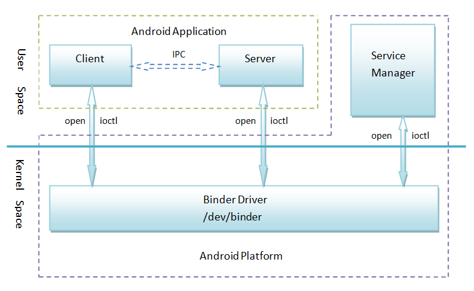

# Android-QA

该库复活了，还是需要一个本地的知识网络，Obsidian值得选择。

- [网络通信](network/README.md)
- [AOSP](aosp/README.md)
- [第三方库](third/README.md)
- [Java](java/README.md)
- [设计模式](pattern/pattern.md)
- [[now in android|官方架构]]


# QA
- 描述handler机制的原理
android提供了Handler和Looper来满足线程间的通信。
Handler先进先出原则。Looper类用来管理线程内对象之间的消息交换(Message Exchange)
  1. Looper：一个线程可以产生一个Looper对象，由它来管理此线程里的Message Queue(消息队列)
  2. Handler：你可以构造Handler对象来与Looper沟通，以便push新消息到Message Queue里；或者接收Looper从Message Queue所送出来的消息。
  3. Message Queue：用来存放线程放入的消息。
  4. UI thread通常就是main thread，

- Android中如何访问自定义ContentProvider
  通过ContentProvider的Uri访问开放的数据。
   1. ContentResolver对象通过Context提供的方法getContenResolver()来获得。
   2. ContentResover提供了以下方法来操作：insert delete update query这些方法分别会调用ContenProvider中与之对应的方法并得到返回的结果。。

- Android IPC有哪些方式？优缺点和使用场景？
  - Bundle：在Bundle中附加数据并通过Intent传输
  - 文件共享：两个进程通过读写一个文件来交换数据
  - AIDL: Android Interface Definition Language
  - Messenger:基于消息的进程间通信。
  - ContentProvider:专门用于不同应用间的数据共享
  - Socket：使用TCP和UDP协议进行网络通信
  
    | 名称 |优点|缺点|使用场景 |
    | ---- | ---- | ---- | ---- |
    |Bundle|简单易用|只能传输Bundle支持的数据类型|四大组件间的进程间通信|
    |文件共享|简单易用|不适合高并发场景，并且无法做到进程间的进程通信|无并发访问情形，交换简单的数据实时性不高的场景|
    |AIDL|功能强大，支持一对多并发通信，支持实时通信|使用稍复杂，需要处理好线程同步|一对多通信且有RPC需求|
    |Messenger|功能一般，支持一对多并发通信，支持实时通信|不能很好处理高并发情形，不支持RPC，数据通过Message进行传输，因此只能传输Bundle支持的数据类型|低开发的一对多即使通信，无RPC需求，或者无需返回结果的RPC需求|
    |ContentProvider|在数据源访问方面功能强大，支持一对多开发数据共享，可通过Call方法扩展其他操作|可以理解为受约束的AIDL，主要提供数据源的CRUD操作|一对多的进程间的数据共享|
    |Socket|功能强大，可以通过网络传输字节流，支持一对多并发实时通信|实现细节稍微有点繁琐，不支持直接的RPC|网络数据交集|

    > RPC(Remote Procedure Call Protocol)远程过程调用协议

- Binder的系统架构
  - Service Manager  
  ServiceManager主要负责Android系统中的所有服务，当客户端与服务端进行通信时，首先就会通过Service Manager来查询和取得所需要交互服务。
  当然每个服务也都需要向Service Manager注册自己提供的服务，以便能够供服务端进场查询和获取。
  - 服务(Service)  
  这里的服务即上面所说的服务端，通常也是Android的系统服务，通过Service Manager可以查询和获取某个Service。
  - 客户端  
  这里的客户端一般指Android系统上面的应用服务，它可以请求Service中的服务，比如Activity。
  - 服务代理  
  服务代理指的是客户端应用程序生成的Server代理(proxy)。从应用程序的角度来看，服务代理和本地对象没有差别，都可以调用
  其方法，方法都是同步的，并且返回相应的结果。服务代理也是Binder机制的核心模块。
  - Binder驱动  
  用于实现Binder的设备驱动，主要负责组织Binder的服务节点，调用Binder相关的处理线程，完成实际的Binder传输等，他位于Binder结构的最底层(即Linux内核层)
  他们之间的结构关系如下：
  

    1. Client、Server和Service Manager实现在用户空间中，Binder驱动程序实现在内核空间中
    2. Binder驱动程序和Service Manager在Android平台中已经实现，开发者只需要在用户空间实现自己的Client和Server。
    3. Binder驱动程序提供设备文件/dev/binder与用户空间交互，Client、Server和Service Manager通过open和octl文件
    操作函数与Binder驱动程序进行通信
    4. Client和Server之间的进程间通信通过Binder驱动程序间接实现
    5. Service Manager是一个守护进程，用来管理Server，并向Client提供查询Server接口的能力

  - Binder的工作流程
  1. 客户端首先获取服务器端的代理对象。所谓的代理对象实际上就是在客户端建立一个服务端的“引用”，该代理对象具有服务端的功能，使其
  在客户端访问服务端的方法就像访问本地方法一样。
  2. 客户端通过调用服务器代理对象的方式向服务端发送请求。
  3. 代理对象将用户请求通过Binder驱动发送到服务器进程。
  4. 服务器进程处理用户请求，并通过Binder驱动返回处理结果给客户端的服务器代理对象。
  5. 客户端收到的服务端的返回结果。
  

- AIDL
  - AIDL的工作流程：AIDL文件的本质是系统为我们提供的一种快速实现Binder工具而已，所以AIDL的工作流程可以绕到Binder进行说明。
  - AIDL的使用方法
    - 服务端：服务端首先要创建一个远程Service用来监听客户端的连接请求，然后创建一个AIDL文件，将暴露给客户端的接口在这个AIDL文件中声明，最后在Service中实现这个AIDL接口即可
    - 客户端：首先绑定服务端Service，绑定成功后，将服务端返回的Binder对象转化成AIDL接口所属的类型，接着就可以调用AIDL中的方法了。
    - AIDL文件支持的数据类型
      - 基本数据类型
      - String和CharSequence
      - List:只支持ArrayList，里面的每个元素必须被AIDL支持
      - Map：只支持HashMap，里面的每个元素都必须被AIDL支持，包括key和value
      - Parcelable:所有实现了Parcelable接口的对象
      - AIDL：所有AIDL接口本身都可以在AIDL文件中使用
    - Parcelable和AIDL对象无论是否和当前AIDL文件位于同一个包内，都要显示import进来
    - 服务端实现需要注意并发处理，可以借助Copy-On-Write容器
    - 服务端实现监听时，监听存储容器使用RemoteCallbackList，系统专门提供用来删除跨进程listener的接口
    - AIDL的包结构在服务端和客户端要保持一致，否则出错，因为客户端要反序列号服务端中和AIDL接口相关
      所有类，如果累的完整路径不一样的话，就无法成功反序列化。
    - AIDL调用服务端方法后，会挂起等待，如果服务端进行执行大量耗时操作，会导致客户端ANR。解决方法：
      客户端调用放在非UI线程即可。
  - 实现一个Messenger，基于消息的进程间通信方式
    - 服务端进程：需要在服务端创建一个Service来处理客户端的连接请求，同时创建一个Handler并通过它来创建一个Messenger对象，然后在Service在onBind中返回这个Messenger对象，然后在Service的onBind中返回这个Messenger对象底层的Binder即可。
    - 客户端进程：客户端进程中，首先绑定服务端的Service，绑定成功后用服务端返回的IBinder对象创建一个Messenger，通过这Messenger就可以向服务端发送消息，发送消息的类型为Messger对象。如果需要服务端能够回应客户端，就和服务端一样，我们还需要创建一个Handler并创建一个新的Messenger,并把这个Messenger对象通过Message的replyTo参数传递给服务端，服务端通过这个replyTo参数就可以回应客户端。
    

- LinearLayout和RelativeLayout性能对比
  1. RelativeLayout会让子View调用2次onMeasure，LinearLayout在有weight时，也会调用子View两次
  onMeasure.
  2. RelativeLayout的子View如果高度和RelativeLayout不同，则会引发效率问题，当子View很复杂时，这个问题会更加严重。
  如果可以，尽量使用padding代替margin。
  3. 在不影响层级深度的情况下，使用LinearLayout和FrameLayout而不是RelativeLayout。

- 优化自定义view
  1. 为了加速view，对于频繁调用的方法，需要尽量减少不必要的代码。先从onDraw开始，需要特别注意不应该在这里做内存分配的事情，因为它会导致GC，从而导致卡顿。从初始化或者动画间隙期间做分配内存的动作。不要在动画正在执行的时候做内存分配的事情。
  2. 你还需要尽可能的减少onDraw被调用的次数，大多数时候导致onDraw都是因为调用了invalidate()。因此请尽量减少调用invalidate的次数。如果可能的话，尽量调用含有4个参数的invalidate方法而不是没有参数的invalidate，没有参数的invalidate会强制重绘整个view。
  3. 另一个非常耗时的操作是请求layout。任何时候执行requestLayout，会使得Android UI系统去遍历整个View的层级来计算出每一个view的大小。如果找到有冲突的值，它会重新计算好几次。另外需要尽量保持View的层级是扁平化，这样对提高效率很有帮助。
  4. 如果你有一个复杂的UI，你应该考虑写一个自定义的ViewGroup来执行他的layout操作。与内置view不同，自定义的view可以使得程序仅仅测量这一部分，这避免了遍历整个view的层级结构来计算大小。

- build.gralde文件
  1. APT：annotationProcessor和android-apt功能是一样的，它们是替代关系。
    APT(Annotation Processing Tool)是一种处理注解的工具，它对源代码文件进行检测找出其中的Annotation，根据注解自动生成代码。Annotation处理器在处理Annotation时可以根据源文件中的Annotation生成额外的源文件和其它文件，APT还会编译生成的源文件和原来的源文件，将它们一起生成class文件。APT处理要素：注解处理器(AbstractProcess)+代码处理(javaPoet)+处理器注册(AutoService)+apt

  2. annotationProcessor
    annotationProcessor是APT工具的一种，它是google开发的内置框架，不需要引入，可以直接在build.gradle文件中使用。

        ```text
        dependencies {
            annotationProcessor project(':xx')
            annotationProcessor 'com.jakenharton:butterkinfe-compiler:8.4.0'
        }
        ```

  3. Provided和annotationProcessor区别
     - annotationProcessor:只在编译的时候执行依赖的库，但是库最终不打包到apk中，编译库中的代码没有直接使用的意义，也没有提供开发的api调用，最终的目的是得到编译库中生成的文件供我们调用
     - Provided：Provided虽然也是编译时运行，最终不会打包到apk中,Provided是间接的得到了依赖的Library，运行的时候必须要保证这个Library的存在，否则就会崩溃，起到了避免依赖重复资源的作用。
