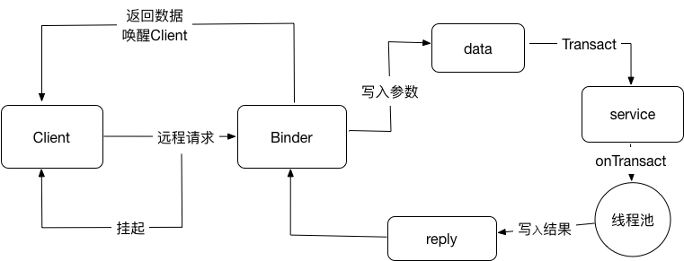

# Android-QA
0. [设计模式](pattern.md)
1. [Effective Java for Android (cheatsheet)](/Effective.md)
2. ​[管理在ViewGroup中的Touch Event](TouchEvent.md)
3. [Android Context](Context.md)
4. [RemoteViews](RemoteViews.md)
5. [Get与Post的区别](GetAndPost.md)
6. [handler机制](handler.md)
7. [webView的内存和性能优化](webView.md)
8. [View的绘制过程](measure_layout_draw.md)
9. [Android下的网络通信](network.md)
* app 被杀掉进程后，是否还能收到广播的问题？

  自android 3.1开始，系统自动给所有intent添加了FLAG_EXCLUDE_STOPPED_PACKAGES，导致app处于停止状态就不能收到广播。要想处于停止状态的app收到广播，需要添加FLAG_INCLUDE_STOPPED_PACKAGES这个标记。这样的话，停止的app应该是收不到系统广播了

* 列举java的集合和继承关系

```
├── Collection
│   ├── List
│   │   ├── LinkedList
│   │   ├── ArrayList
│   │   ├── Vector
│   │   │   ├── Stack
│   ├── Set 

├── Map
│   ├── Hashtable
│   ├── HashMap
│   ├── WeakHashMap
```


* HashMap的实现原理

  1. HashMap概述：HashMap是基于哈希表的Map接口的非同步实现。此实现提供所有可选的映射操作，并允许使用null和null键。此类不保证映射的顺序

* HashMap和HashTable的区别

  1. 继承和实现的区别

     Hashtable是基于陈旧的Dictionary类，完成了Map接口；HashMap是Java 1.2引进的Map接口的一个实现。

  2. 线程安全不同

     HashTable的方法是同步的，HashMap是未同步，所以在多线程场合要手动同步HashMap。

  3. 对null处理不同

     Hashtable不允许null值(key和value都不可以)，HashMap允许null值(key和value都可以)。

  4. 方法不同

     Hashtable有一个contains(Object value)，功能和containsValue(Object value)功能一样。

  5. Hashtable使用Enumeration,HashMap使用使用Iterator。

  6. Hashtable中hash数组默认大小是11，增加的方式是old*2 + 1。HashMap中hash数组的默认大小是16，而且一定是2的指数。

* 进程和线程的区别

  * 程序至少有一个进程，一个进程至少有一个线程
  * 线程的划分尺度小于进程，使得多线程程序的并发性高。
  * 进程在执行过程中拥有独立的内存单元，而多个线程共享内存，从而极大地提高了程序的运行效率。
  * 线程在执行过程中与进程还是有区别的。每一个独立的线程有一个程序运行的入口、顺序执行序列和程序的出口。但是线程不能够独立执行，必须依存在应用程序中，由应用程序提供多个线程执行控制。
  * 线程是进程的一个实体，是CPU调度和分派的基本单位，它是比进程更小的能独立运行的基本单位，线程自己基本上不拥有系统资源，只拥有一点在运行中必不可少的资源，但是它可与同一个进程的其他线程共享进程所拥有的全部资源。
  * 一个线程可以创建和撤销另一个线程；同一个进程的多个线程可以并发执行

* 抽象类接口区别

  1. 默认的方法实现 抽象类可以有默认的方法实现完全是抽象的。接口根本不存在方法的实现。(在java8中新增了新特性，接口也可以有default扩展方法)

  2. 实现子类使用extends关键字来继承抽象类。如果子类不是抽象类的话，它需要提供抽象类中所有声明的方法的实现。子类使用关键字implements来实现接口。它需要提供接口中所有声明的方法的实现

  3. 构造器

     抽象类可以有构造器 接口不能有构造器

  4. 与正常Java类的区

     除了你不能实例化抽象类之外，它和普通Java类没有任何区别，接口是完全不同的类型。

  5. 访问修饰符

     抽象方法可以有public、protected和default这些修饰符，接口方法默认修饰符是public。你不可以使用其它修饰符。

  6. main方法

     抽象方法可以有main方法并且我们可以运行它

     接口没有main方法，因此我们不能运行它。

  7. 多继承

     抽象类在java语言中所表示的是一种继承关系，一个子类只能存在一个父类，但是可以存在多个接口。

  8. 添加新方法

     如果你往抽象类中添加新的方法，你可以给它提供默认的实现。因此你不需要改变你现在的代码。

     如果你往接口中添加方法，那么你必须改变实现该接口的类。
  
* 描述handler机制的原理
android提供了Handler和Looper来满足线程间的通信。
Handler先进先出原则。Looper类用来管理线程内对象之间的消息交换(Message Exchange)
  1. Looper：一个线程可以产生一个Looper对象，由它来管理此线程里的Message Queue(消息队列)
  2. Handler：你可以构造Handler对象来与Looper沟通，以便push新消息到Message Queue里；或者接收Looper从Message Queue所送出来的消息。
  3. Message Queue：用来存放线程放入的消息。
  4. UI thread通常就是main thread，

* Android中如何访问自定义ContentProvider

  通过ContentProvider的Uri访问开放的数据。
   1. ContentResolver对象通过Context提供的方法getContenResolver()来获得。
   2. ContentResover提供了以下方法来操作：insert delete update query这些方法分别会调用ContenProvider中与之对应的方法并得到返回的结果。。

* Android IPC有哪些方式？优缺点和使用场景？
  * Bundle：在Bundle中附加数据并通过Intent传输
  * 文件共享：两个进程通过读写一个文件来交换数据
  * AIDL: Android Interface Definition Language
  * Messenger:基于消息的进程间通信。
  * ContentProvider:专门用于不同应用间的数据共享
  * Socket：使用TCP和UDP协议进行网络通信

| 名称 |优点|缺点|使用场景 |
| ---- | ---- | ---- | ---- |
|Bundle|简单易用|只能传输Bundle支持的数据类型|四大组件间的进程间通信|
|文件共享|简单易用|不适合高并发场景，并且无法做到进程间的进程通信|无并发访问情形，交换简单的数据实时性不高的场景|
|AIDL|功能强大，支持一对多并发通信，支持实时通信|使用稍复杂，需要处理好线程同步|一对多通信且有RPC需求|
|Messenger|功能一般，支持一对多并发通信，支持实时通信|不能很好处理高并发情形，不支持RPC，数据通过Message进行传输，因此只能传输Bundle支持的数据类型|低开发的一对多即使通信，无RPC需求，或者无需返回结果的RPC需求|
|ContentProvider|在数据源访问方面功能强大，支持一对多开发数据共享，可通过Call方法扩展其他操作|可以理解为受约束的AIDL，主要提供数据源的CRUD操作|一对多的进程间的数据共享|
|Socket|功能强大，可以通过网络传输字节流，支持一对多并发实时通信|实现细节稍微有点繁琐，不支持直接的RPC|网络数据交集|

> RPC(Remote Procedure Call Protocol)远程过程调用协议

* Binder的系统架构
  * Service Manager  
  ServiceManager主要负责Android系统中的所有服务，当客户端与服务端进行通信时，首先就会通过Service Manager来查询和取得所需要交互服务。
  当然每个服务也都需要向Service Manager注册自己提供的服务，以便能够供服务端进场查询和获取。
  * 服务(Service)  
  这里的服务即上面所说的服务端，通常也是Android的系统服务，通过Service Manager可以查询和获取某个Service。
  * 客户端  
  这里的客户端一般指Android系统上面的应用服务，它可以请求Service中的服务，比如Activity。
  * 服务代理  
  服务代理指的是客户端应用程序生成的Server代理(proxy)。从应用程序的角度来看，服务代理和本地对象没有差别，都可以调用
  其方法，方法都是同步的，并且返回相应的结果。服务代理也是Binder机制的核心模块。
  * Binder驱动  
  用于实现Binder的设备驱动，主要负责组织Binder的服务节点，调用Binder相关的处理线程，完成实际的Binder传输等，他位于Binder结构的最底层(即Linux内核层)
  他们之间的结构关系如下：
  

    1. Client、Server和Service Manager实现在用户空间中，Binder驱动程序实现在内核空间中
    2. Binder驱动程序和Service Manager在Android平台中已经实现，开发者只需要在用户空间实现自己的Client和Server。
    3. Binder驱动程序提供设备文件/dev/binder与用户空间交互，Client、Server和Service Manager通过open和octl文件
    操作函数与Binder驱动程序进行通信
    4. Client和Server之间的进程间通信通过Binder驱动程序间接实现
    5. Service Manager是一个守护进程，用来管理Server，并向Client提供查询Server接口的能力

  * Binder的工作流程
  1. 客户端首先获取服务器端的代理对象。所谓的代理对象实际上就是在客户端建立一个服务端的“引用”，该代理对象具有服务端的功能，使其
  在客户端访问服务端的方法就像访问本地方法一样。
  2. 客户端通过调用服务器代理对象的方式向服务端发送请求。
  3. 代理对象将用户请求通过Binder驱动发送到服务器进程。
  4. 服务器进程处理用户请求，并通过Binder驱动返回处理结果给客户端的服务器代理对象。
  5. 客户端收到的服务端的返回结果。
  


