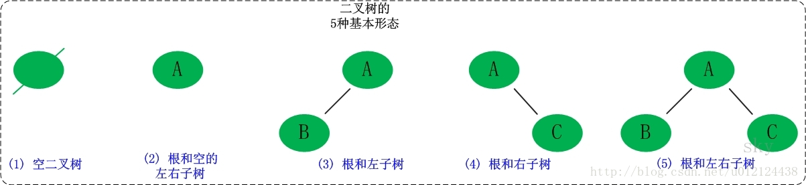

# 二叉树
在计算机科学中，二叉树是每个节点最多有两个树的树结构。通常子树被称作“左子树(left subtree)”和“右子树(right subtree)”。  

## 五种形态：

二叉树的每个节点至多只有两棵子树（不存在度大于2的节点），二叉树的子树有左右之分，次序不能颠倒。

## 二叉树的性质

1. 二叉树的第i层至多有" />个节点(i>=1)。
2. 深度为k的二叉树至多共有个节点。
3. 对任何一颗二叉树T，如果其终端结点数为
对任何一棵二叉树T，如果其终端节点数为,度为2的节点数为，则
4. 包含n个结点的二叉树的高度至少为
5. 如果对一个n个结点的完全二叉树(其深度为)的结点按层序编号（从第1层到第）

一棵深度为k，且有\\(2^{k+1}-1\\)个节点，称为k，有n个节点的二叉树，当且仅当其每一个节点都与深度为k的
满二叉树中，序号为1至n的节点对应时，称之为完全二叉树。

与树不同，树的节点个数至少为1，而二叉树的节点个数可以为0；树中节点的最大度数没有限制，而二叉树节点最大度数为2；
树的节点无左、右之分，而二叉树的节点有左、右之分。

## 二叉树的类型
二叉树是有个有根树，并且每个节点最多有2个子节点。非空的二叉树，若树叶总数为\\(n_0\\),分支度为2的总数
\\(n_2\\)，则\\(n_0=n_2+1\\)
一棵深度为k，且有\\(2^k-1\\)个节点的二叉树，称为满二叉树。这种树的特点是每一层上的节点数都是最大节点数。
而在一棵二叉树中，除最后一层或者是满的，或者在右边缺少连续若干节点，则此二叉树为完全二叉树。

