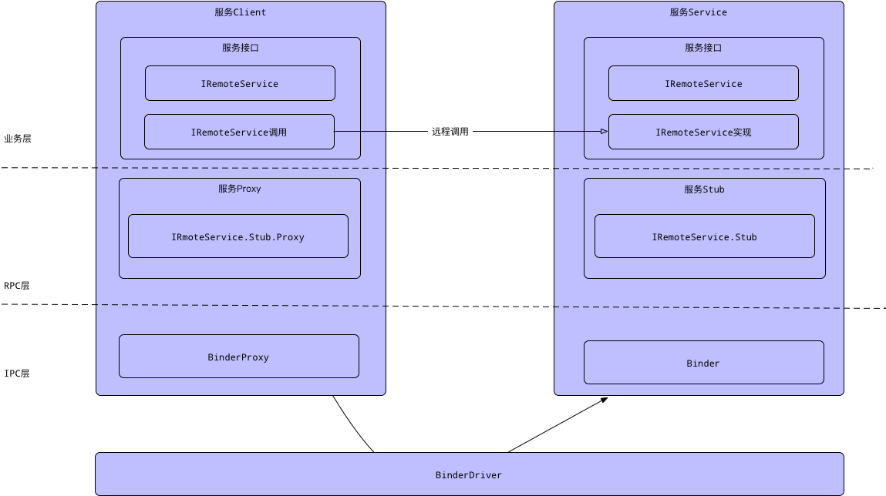
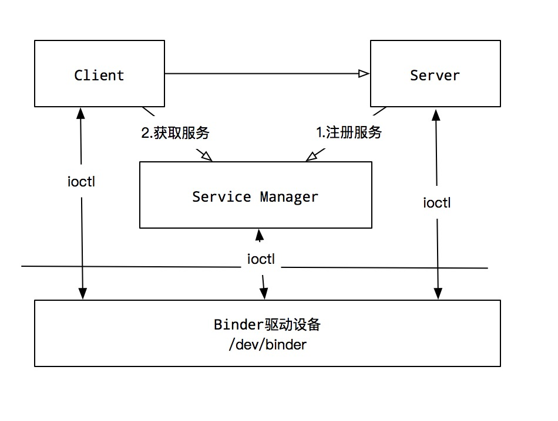

# 一、概述

Android系统中，每个应用程序是由Android的Activity,Service,Broadcast,ContentProvider
这四剑客中一个或多个组合，四大组件涉及的多进程间的通信底层都是依赖于Binder IPC机制。

1. 从IPC角度来说：Binder是Android中的一种跨进程通信方式，该通信方式在linux中没有，是Android独有
2. 在Android Driver层：Binder还可以理解一种虚拟的物理设备，它的设备驱动是/dev/binder
3. 从Adnroid Native层：Binder是创建Service Manager以及BpBinder/BBinder模型，搭建与binder驱动的桥梁
4. 从Android Framework层：Binder是各种Manager(ActivityManager、WindowManager等)和相应xxxManagerService的桥梁
5. 从Android APP层：Binder是客户顿和服务端进行通信的媒介，当bindService的时候，服务端会返回一个包含了服务端业务调用的Binder对象，通过这个Binder对象，客户端就可以获取服务端提供的服务或者数据，这里的服务包括普通服务和基于AIDL的服务

Linux现有的进程通信手段：

1. 管道：在创建时分配一个page大小的内存，缓存区大小比较有限
2. 消息队列：信息复制两次，额外的CPU消耗，不合适频繁或信息量打的通信
3. 共享内存：无需复制，共享缓冲区直接附加到进程虚拟地址空间，速度快；但进程间的同步问题操作系统无法实现，必须各进程利用同步工具解决
4. 套接字：作为更通用的接口，传输效率低，主要用于不通机器或跨网的通信
5. 信号量：常作为一种锁机制，防止某进程正在访问共享资源时，其他进程也访问该资源。因此，主要作为进程间以及同一进程内不同线程之间的同步手段。6. 信号: 不适用于信息交换，更适用于进程中断控制，比如非法内存访问，杀死某个进程等；

重新设计一套Binder机制，出于：

1. 高性能：从数据拷贝次数来看Binder只需进行一次内存拷贝，而管道、消息队列、Socket都需要两次，共享内存不需要拷贝，Binder的性能仅次于共享内存
2. 稳定性：上面说到共享内存的性能优于Binder，那为什么不适用共享内存呢，因为共享内存需要处理并发同步问题，控制负责，容易出现死锁和资源竞争，稳定性较差。而Binder基于C/S架构，客户端与服务端彼此独立，稳定性较好
3. 我们知道Android为每个应用分配了UID，用来作为鉴别进程的重要标志，Android内部也依赖这个UID进行权限管理，包括6.0以前的固定权限和6.0以后的动态权限，传统IPC只能由用户在数据包里填入UID/PID，这个标记完全

是在用户空间控制的，没有放在内核空间，因此有被恶意篡改的可能，因此Binder的安全性更高

## 从内核空间与用户空间角度


每一个Android应用都是一个独立的Android进程，它们拥有自己独立的虚拟地址空间，应用进程处于用户空间之中，彼此之间互相独立，不能共享。但是内核空间却是可以共享的，Client进程向Server进程通信，就是利用进程间可以共享的内核地址空间来完成底层的通信工作。Client进程与Server端进程往往采用ioctl等方法跟内核空间的驱动进行交互

## 从Java与C++分层的角度


整个Binder通信机制中，从大的方面可以分为:

- Framework Binder
- Native Binder

Framework Binder最终通过JNI调用Native Binder的功能，它们在架构上的设计都是C/S架构

关键角色：

- Client：客户端
- Server：服务端
- ServiceManager：C++层的ServiceManager，Binder通信机制的大管家，Android进程间通信机制Binder的守护进程
- Binder Driver：Binder驱动

整个流程：

1. Server进程将服务注册到ServiceManager
2. Client进程向ServiceManager获取服务
3. Client进程得到的Service信息后，建立Server进程的通信通道，然后就可以和Server进程进行交互了

## Binder通信流程

### AIDL(Android Interface Definition Language)



1. 定义AIDL文件IRemoteService.aidl，定义远程服务需要提供的功能

    ```java
    interface IRemoteService {
        String getMessage();
    }
    ```

2. 定义服务端RemoteService，提供服务，在进程RemoteService.Process
    这个对象(Binder)有两个特性：
    1. 具有完全特定任务的能力
    2. 一个是被跨进程传输的能力

    ```java
    private IRemoteService.Stub mBinder = new IRemoteService.Stub() {
        @Override
        public String getMessage() {
            return "I am a message from RemoteService";
        }
    }
    ```

    ```java
    public class Binder implement IBinder {
        void attachInterface(IInterface plus, String descriptor)
        IInterface queryLocalInterface(String descriptor)
        boolean onTransact(int code, Parcel data, Parcel reply, int flags)

        final class BinderProxy implements IBinder {
            IInterface queryLocalInterface(String descriptor) {
                return null;
            }
        }
    }
    ```
    Binder具有被跨进程传输的能力是因为它实现了IBinder接口，系统会为每个实现了该接口的对象提供跨进程传输

    Binder具有的完成特定任务的能力是通过它的attachInterface方法获得的，Binder对象可通过attachInterface方法持有一个IInterface对象的引用，并依靠它获得完成特定任务的能力，queryLocalInterface方法可以认为是根据descriptor查找相应的IInterface对象。

3. 定义客户端ClientActivity，与RemoteSevice绑定，获取服务，在进程ClientActivity.Process

    ```java
    ServiceConnection serviceConnection = new ServiceConnection() {
        @Override
        public void onServiceConnected(ComponentName name, IBinder service) {
            IRemoteService iRemoteService = IRemoteService.Stub.asInterface(service);
            Log.d(TAG, iRemoteService.getMessage());
        }

        @Override
        public void onServiceDisconnected(ComponentName name) {
            Log.d(TAG, "onServiceDisconnected");
        }
    }
    ```

    RemoteService中的IRemoteService文件自动编译生成了一个类：

    ```java
    public interface IRemoteService extends android.os.IInterface {
        public static abstract class Stub extends android.os.Binder implement com.gothic.lolita.aidl.IRemoteService {
            private static final java.lang.String DESCRIPTOR = "com.gothic.lolita.aidl.IRemoteService";
            public Stub() {
                this.attachInterface(this. DESCRIPTOR);
            }

            //将Binder对象转换成RemoteService接口的实现类，供客户端使用
            public static com.gothic.lolita.aidl.IRemoteService asInterface(android.os.IBinder obj) {
                if (obj == null) {
                    return null;
                }
                android.os.IInterface iin = obj.queryLocalInterface(DESCRIPTOR);
                if (((iin!=null)&&(iin instanceof com.gothic.lolita.aidl.IRemoteService))) {
                    return ((com.gothic.lolita.aidl.IRemoteService)iin);
                }
                return new com.gothic.lolita.aidl.IRemoteService.Stub.Proxy(obj);
            }

            @Override
            public android.os.IBinder asBinder() {
                return this;
            }

            @Override
            public boolean onTransact(int code, android.os.Parcel data, android.os.Parcel reply, int flags) throws android.os.RemoteException {
                switch (code) {
                    case INTERFACE_TRANSACTION: {
                        reply.writeString(DESCRIPTOR);
                        return true;
                    }
                    case TRANSACTION_getMessage: {
                        data.enforceInterface(DESCRIPTOR);
                        int _result = this.getMessage();
                        reply.writeNoException();
                        reply.writeString(_result);
                        return true;
                    }
                }
                return super.onTransact(code, data, reply, flags);
            }

            //Proxy类，它实现了定义的RemoteService接口，写入传递给Stub的参数，读取Stub返回的值
            private static class Proxy implements com.gothic.lolita.aidl.IRemoteService {
                private android.os.IBinder mRemote;
                Proxy(android.os.IBinder remote) {
                    mRemote = remote;
                }

                @Override
                public android.os.IBinder asBinder() {
                    return mRemote;
                }

                public java.lang.String getInterfaceDescriptor() {
                    return DESCRIPTOR;
                }

                @Override
                public String getMessage() throws android.os.RemoteException {
                    android.os.Parcel _data = android.os.Parcel.obtain();
                    android.os.Parcel _reply = android.os.Parcel.obtain();
                    java.lang.String _result;
                    try {
                        _data.writeInterface(DESCRIPTOR);
                        mRemote.transact(Stub.TRANSACTION_getMessage, _data, _reply, 0);
                        _reply.readException();
                        _result = _reply.readString();
                    } finally {
                        _reply.recycle();
                        _data.recycle();
                    }
                    return _result;

                }
            }

            static final int TRANSACTION_getMessage = (android.os.IBinder.FIRST_CALL_TRANSACTION + 0));

        }
        public java.lang.String getMessage() throws android.os.RemoteException;
    }
    ```

    > AIDL目的是为了实现跨进程访问，即获得另一个进程的对象，并访问其方法。其本质上是一个接口，它会自动生成一个继承Binder的接口和Stub、Proxy两个类
    - Stub：它继承于Binder，同样也实现了我们定义的IRemoteService接口，读取Proxy传递过来的参数，并写入返回给Proxy的值
    - Proxy：它是Stub的内部类，实现了我们定义的IRemoteService接口，写入传递给Stub的参数，读取Stub返回的值。它本身是私有的，通过Stub的asInterface()方法暴露给外部使用

Binder是Android系统中的一种IPC进程间通信结构
Binder的整个设计是C/S结构，客户端进程通过获取服务端进程的代理，并通过向这个代理接口方法中读取数据来完成进程间的数据通信。

### Binder原理

Binder通信采用C/S架构，从组件视角来说，包含Client、Server、ServiceManager以及binder驱动，其中ServiceManager用于管理系统中的各种服务。架构图如下所示：


可以看出无论是注册服务和获取服务的过程都需要ServiceManager，需要注意的是此处的ServiceManager是指Native层的ServiceManager，并非指framework的ServiceManager。
ServiceManager是整个Binder通信机制的大管家，是Android进程间通信机制Binder的守护进程。

1. 注册服务(addService)：Server进程要先注册Service到ServiceManager。该过程：Server是客户端，ServierManager是服务端。
2. 获取服务(getService)：Client进程使用某个Service前，须向ServiceManager中获取相应的Service。该过程：Client是客户端，ServiceManager是服务端。
3. 使用服务：Client根据得到的Service信息建立与Service所在的Server进程通信的通路，然后就可以直接与Service交互。该过程:client是客户端，server是服务端。

图中的Client,Server,Service Manager之间交互都是虚线表示，是由于它们彼此之间不是直接交互的，而是都通过与Binder驱动进行交互的，从而实现IPC通信方式。其中Binder驱动位于内核空间，Client,Server,Service Manager位于用户空间。

Binder驱动和Service Manager可以看做是Android平台的基础架构，而Client和Serer是Android的应用层。

### C/S模式

BpBinder(客户端)和BBinder(服务端)都是Android中Binder通信相关的代表，它们都从IBinder类中派生而来：

- client端:BpBinder.transact()来发送事务请求;
- server端:BBinder.onTransact()会接收到相应事务。

### 架构


- 图中红色代表整个framework层binder架构相关组件
  - Binder类代表Server端，BinderProxy类代码Client端；
- 图中蓝色代表Native层Binder架构相关组件
- 上层framework层的Binder逻辑是建立在Native层架构基础之上，核心逻辑都是交予Native层方法来处理。
- framework层的ServiceManager类与Native层的功能并不完全对应，framework层的ServiceManager类实现最终是通过BinderProxy传递给Native层来完成的

### 类图


1. ServiceManager:通过getIServiceManager方法获取的是ServiceManagerProxy对象；
    ServiceManager的addService，getService实际工作都交由ServiceManagerProxy的相应方法来处理；
2. ServiceManagerProxy:其成员变量mRemote指向BinderProxy对象，ServiceManagerProxy的addService,getService()方法最终交由mRemote来完成。
3. ServiceManagerNative：其方法asInterface()返回的是ServiceManagerProxy对象，ServiceManager便是借助ServiceManagerNative类来找到ServiceManagerProxy；
4. Binder：其成员变量mObject和方法execTransact()用于native方法
5. BinderInternal：内部有一个GcWatcher类，用于处理和调试与Binder相关的垃圾回收
6. IBinder:接口中常量FLAG\_ONEWAY，客户端利用binder跟服务端通信是阻塞式的，但如果设置了FLAG\_ONEWAY，这成为非阻塞的调用方式，客户端能立即返回，服务端采用回调方式来通知客户端完成情况。另外IBinder接口有一个内部接口DeathDecipient

### Binder类分层

整个Binder从kernel至，native, JNI, Framework层所涉及的全部类


## 二、初始化