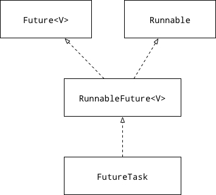

# Java并发编程FutureTask

## Future

执行Runnable任务，他的run()方法是没有返回值的，那如果我们想要执行一个任务，并且能够拿到一个返回值结果

Future是一个接口，他提供了方法来检测当前的任务是否已经结束，还可以等待任务结束并且拿到一个结果，通过调用Future的get()方法可以当任务结束后返回一个结果只，如果工作没有结束，则会阻塞当前线程，直到任务执行完毕，可以通过调用cancel方法来停止一个任务，如果任务已经停止，则cancel方法会返回true；如果任务已经完成或者已经停止或者这个任务无法停止，则cancel会返回一个false。当一个任务呗成功停止后，他无法再次执行。isDone()和isCancel()方法可以判断当前工作是否完成和是否取消。

## Callable

```java
public interface Callable<V> {
    V call throws Exception;
}
```

Callable就有返回值，这个返回值是一个泛型，也就是说根据需求指定要返回的result的类型

## FutureTask

```java
public class FutureTask<V> implements RunnableFuture<V> {
    ...
}
```

```java
public interface RunnableFuture<V> extends Runable, Future<V>{
    ...
}
```

FutureTask的一个很好的特点是有一个回调函数done()方法，当一个任务执行结束后，会回调这个done()方法，可以在done()方法中调用FutureTask的get()方法来获得计算的结果。android开发中，如果在主线程调用futureTask.get()方法时，会阻塞UI线程。

Future#run()->Callable#call()

```java
public void run() {
    if (state != NEW || !UNSAFE.compareAndSwapObject(this, runnerOffset, null, Thread.currentThread()))
    return;
    
    try {
        Callable<V> c = callable;
        if (c != null && state == NEW) {
            V result;
            boolean ran;
            try {
                result = c.call();
                ran = true;
            } catch(Throwable ex) {
                result = null;
                ran = false;
                setException(ex);
            }
            if (ran) {
                set(result);
            }
        } finally {
            runner = null;
            int s = state;
            if (s >= INTERRUPTING) {
                handlePossibleCancellationInterrupt(s);
            }
        }

    }
}
```

所以一个FutureTask实际上执行的是一个Callable类型实例的call()方法，call()方法才是最终任务

FutureTask：一个可以取消的异步任务执行类，这个类提供了Future接口的基本实现，主要有以下功能：

- 异步执行任务
- 可以开始、取消以及查看任务是否完成
- 如果任务没有执行完，get方法会导致线程阻塞
- 一旦一个执行任务已经完成就不能再次开始和结束(除非执行时通过runAndReset()方法)

### 类关系



### 成员变量

|修饰符|变量名|描述|
|:---:|:---:|:---:|
|Callable|callable|任务执行体|
|Object|outcone|最终输出的结果|
|volatile Thread|runner|异步执行任务的线程|
|volatile WaitNode|waiters|获取任务结果的等待线程(是一个链式列表)|
|volatile int|state|当前一步任务的状态|
|static final int|NEW|任务初始状态|
|static final int|COMPLETING|任务已完成，但结果还没有复制给outcome|
|static final int|NORMAL|任务执行完成|
|static final int|EXCEPTIONAL|任务执行异常|
|static final int|INTERRUPTING|任务被中断中|
|static final int|INTERRUPTED|任务被中断|

### 构造函数及方法

通过传入Callable来构造一个任务

```java
public FuntureTask(Callable callable) {
    if (callable == null)
        throw new NullPointerException();
    this.callable = callable;
    this.state = NEW;
}
```

通过传入Runnable来构造一个任务

```java
public FuntureTask(Runnable runnable, V result) {
    this.callable = Executors.callable(runnable, result);
    this.state = NEW;
}
```

|修饰符|方法|描述|
|boolean|cancle(boolean mayInterruptfRunning)|取消或者中断任务(true为中断，false为取消)|
|V|get()|返回执行结果，行为完成执行时，则阻塞线程|
|V|get(long timeout, TimeUnit unit)|获取执行结果，当时间超出设定时间时，则返回超时|
|boolean|isCancelled()|返回任务是否已经取消|
|boolean|isDone()|判断任务是否执行完毕|

### 执行状态转换

执行任务时可能有4种状态转换：

1. 任务顺利执行：NEW->COMPLETING->NORMAL
2. 任务执行异常：NEW->COMPLETING->EXCEPTIONAL
3. 任务取消：NEW->CANCELLED
4. 任务终端：NEW->INTERRUPTING->INTERRUPTED

### get方法

get方法用来返回`Future`关联的任务的结果。带参数的`get`方法指定一个超时时间，在超时时间内该方法会阻塞当前线程，直到获得结果。

- 如果在给定的超时时间内没有获得结果，那么便抛出`TimeoutException`异常
- 或者执行的任务被取消（此时抛出`CancelationException异常`）
- 或者执行任务时出错，即执行过程中出现异常（此时抛出ExecutionException异常）
- 或者当前线程被中断（此时抛出InterruptedException异常--注意，当前线程是指调用`get`方法的线程，而不是运行任务的线程）
    不带参数的`get`可以理解为超时时间无限大，即一直等待直到获得结果或者出现异常

### cancel(boolean mayInterruptIfRunning)

该方法是非阻塞的。该方法可以用来尝试终止一个任务

- 如果任务运行之前调了该方法，那么任务就不会被运行
- 如果任务已经完成或者已经被取消，那么该方法不起作用
- 如果任务正在运行，并且`cancel`传入参数为true，那么便会去终止与`Future`关联的任务

`cancel(false)`与`cancel(true)`的区别在于，`cancel(false)`只取消已经提交但没有被运行的任务(即任务就不会被安排运行)；而`cancel(true)`会取消所有已经提交的任务，包括正在等待和正在运行的任务

`isCancelled`方法：该方法是非阻塞的。在任务结束之前，如果任务被取消，该方法返回`true`，否则返回`false`；如果任务已经完成，该方法则一直返回`false`

`isDone`方法：该方法同样是非阻塞的。如果任务已经结束(正常结束，或者被取消，或者执行出错)，返回`true`，否则返回`false`

### cancel(true)
