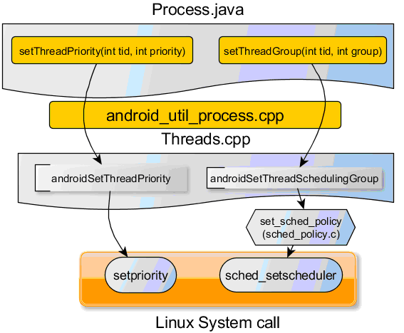

#Android平台中的进程调度接口

- 讨论Process.java提供的setThreadPriority和setThreadGroup函数
- 调用分发顺序从java一直贯穿JNI,Native层后，setThreadPriority直接转移到setPriority系统调用，而setThreadGroup通过set\_sched\_policy处理后，再转移给sched_setscheduler系统调用

#设置调度优先级
OS在调度进程的时候是遵循一定规则的，优先级高的进程分配CPU的时间多，而优先级低的进程相对分配的CPU时间少。(理论上，具体时间分配是和OS相关的)

#进程调度相关基础知识
在一个系统中，经常运行着多个进程，和CPU个数相比，当然进程数远远大于CPU个数，那么就存在为进程分配CPU资源的问题。一般而言，有两种分配方式，一个由进程间协调，例如一个比较友好的进程在一定的时刻主动让出CPU，这样其他进程就有机会使用CPU。但是这种类似道德上的约束往往行不通，因为总会有恶意进程存在！