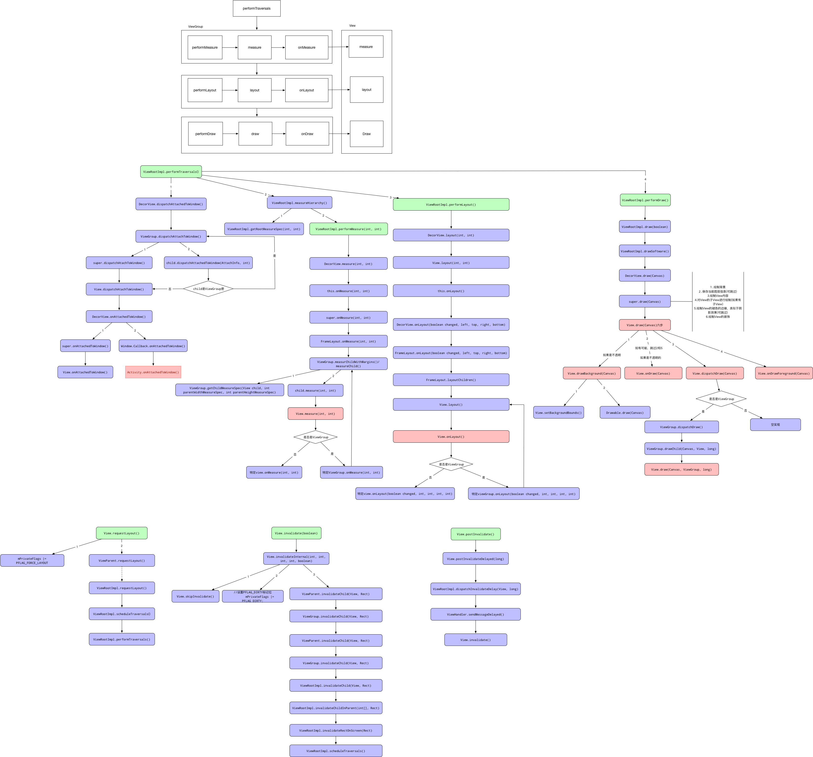
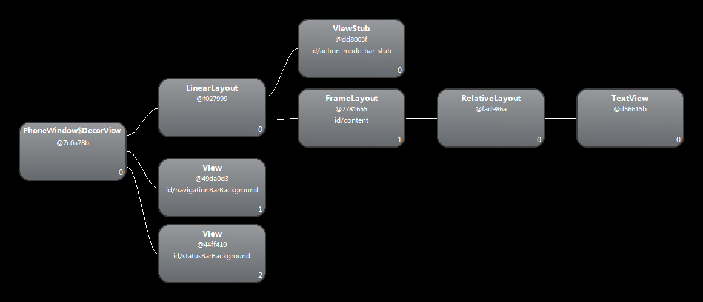
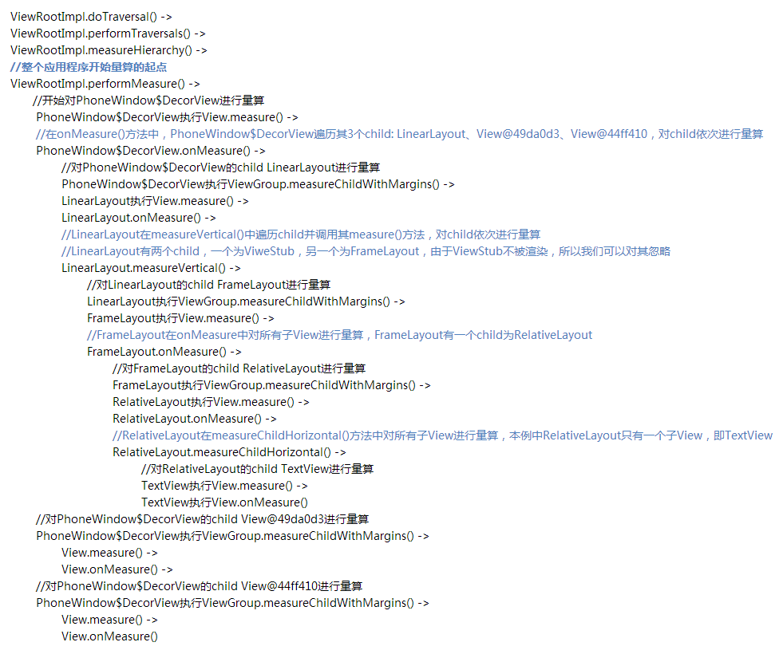
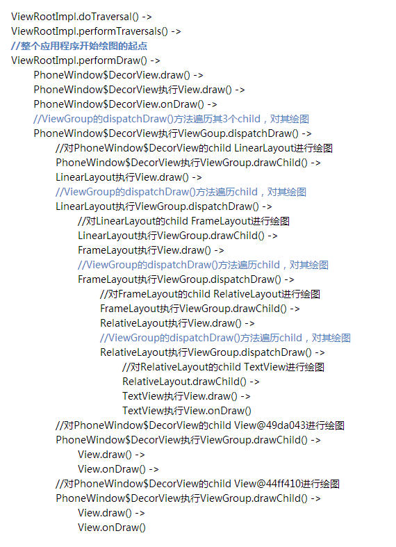

# 测量、定位和绘制



任何一控件其实都是直接或间接继承自View实现的，所以说View应该具有相同的绘制流程与机制才能显示到屏幕上
每一个View的绘制过程都必须经历三个最主要的过程，也就是measure、layout和draw。

```text
├── View
│   ├── measure(int, int) 测量view多大，父提供参数，该方法会调用onMeasure(int,int)
|   ├── onMeasure(int, int) 此方法可以被覆盖，子类有责任测量宽高
|   ├── layout(int, int, int, int) 布局定位，除了ViewGroup实现了,其他并不需要
|   ├── onLayout(boolean, int, int, int, int) 包含子的派生类需要实现，并且每个子要调用layout方法
|   ├── onDraw(Canvas) 绘制需要重写的方法
|   ├── draw(Canvas) 绘制流程的主方法，一般不重写
|   ├── draw(Canvas, ViewGroup, long) 该方法是ViewGroup.drawChild调用的，用于每个子类进行绘制自身
|   ├── dispatchDraw(Canvas) 绘制流程用于绘制子views，会被派生类重载，在children绘制之前。

├── ViewGroup
│   ├── layout(int, int, int, int) //ViewGroup实现了
│   ├── onLayout(boolean, int, int, int, int) //viewGroup是一个抽象类 需要实现
```

## 初始化工作

Activity方法onCreate里执行了setContentView只有View如何显示到屏幕上的。

1. Activity.setContentView->PhoneWindow.setContentView最终会生成一个DecorView对象
2. DecoreView是PhoneWindow类的内部类，继承自FrameLayout，所以调用Activity方法

```text
ViewRootImpl->performTraversals->performMeasure->performLayout->performDraw

performMeasure->view.measure->view.onMeasure
performLayout->view.layout->view.onLayout
performDraw->view.draw->view.onDraw
```

ViewRootImpl，他是链接WindowManager和DecoreView的纽带。更广阔可以说是Window和View之间的纽带
完成View的绘制
向DecoreView分发收到的用户发起的event事件，如按键，触屏等事件

Window是一个抽象概念，每一个Window都对应一个View和一个ViewRootImple,Window又通过ViewRootImpl与View建立联系


## 开始

整个View树的绘图流程是在ViewRootImpl类的performTraversals()方法，该函数做的执行过程主要是根据之前设置的状态，判断是否重新计算视图大小
(measure)、是否重新放置视图的位置(layout)、以及是否重绘(draw)，其核心也就是判断来选择顺序执行这三个方法中的哪个。

1. Android自上而下对所有View进行量算，这样Android就知道了每个View想要的大小，即宽高信息
2. 在完成了所有的View的量算工作后，Android会自上而下对所有View进行布局，Android就知道了每个View在其父控件中的位置，即View到其父控件四边
3. 在完成了对所有View的布局工作后，Android会自上而下对所有View进行绘图，这样Android就将所有的View渲染到屏幕上。

MeasureSpec并不是指View的测量宽高，MeasureSpec作用在于：在Measure流程中，系统会将
View的LayoutParams根据父容器所施加的规则转换成对应的MeasureSpec，
然后在onMeasure方法中根据这个MeasureSpec来确定View的测量宽高。

* MeasureSpec数值（数值1080(二进制为: 1111011000)为例）

    |模式名称|模式数值(高2位)|实际数值(低30位)|
    |---|---|----|
    |UPSPECIFIED|00|000000000000000000001111011000|
    |EXACTLY|01|000000000000000000001111011000|
    |AT_MOST|10|000000000000000000001111011000|
* View.MeasureSpec:

    |模式|二进制数值|描述|
    |---|---|----|
    |UPSPECIFIED|00|默认值，父控件没有给子view任何限制，子View可以设置为任意大小|
    |EXACTLY|01|表示父控件已经确切的指定了子View的大小|
    |AT_MOST|10|表示子View具体大小没有尺寸限制，但是存在上限，上限一般为父View大小|

* 上面的测量模式跟`wrap_content`、`match_parent`以及写成固定的尺寸关系

    |对应关系|描述|
    |---|---|
    |match\_parent:EXACTLY|怎么理解呢？match_parent就是要利用父View给我们提供的所有剩余空间，而父View剩余空间是确定的，也就是这个测量模式的整数里面存放的尺寸。  |
    |wrap\_content:AT_MOST|怎么理解：就是我们想要将大小设置为包裹我们的view内容，那么尺寸大小就是父View给我们作为参考的尺寸，只要不超过这个尺寸就可以啦，具体尺寸就根据我们的需求去设定| 
    |固定尺寸[如100dp]:EXACTLY|用户自己指定了尺寸大小，我们就不用再去干涉了，当然是以指定的大小为主啦|

```java
int childWidthMeasureSpec = getRootMeasureSpec(mWidth, lp.width);
int childHeightMeasureSpec = getRootMeasureSpec(mHeight, lp.height);
 // Ask host how big it wants to be
performMeasure(childWidthMeasureSpec, childHeightMeasureSpec);
```

## measure测量流程

所有View自上而下量算的过程：


如果要进行量算过程的View是ViewGroup类型，那么ViewGroup会在onMeasure方法内部遍历子View依次进行量算。

* 整个应用量算的起点是ViewRootImpl类，从它开始依次对子View进行量算，如果子View是一个ViewGroup，那么又会遍历该ViewGroup的子View依次进行量算，量算会从View树的根节点，纵向递归进行，从而实现自上而下对View进行量算，直至完成对叶子节点View的量算

* 如果对一个View进行量算呢？Android通过调用View的measure()方法对View进行量算，让该View的父控件知道该View想要多大的尺寸空间

* 具体来说，View的父控件ViewGroup会调用View的measure方法，ViewGroup会将一些宽度和高度的限制条件传递给View的measure方法

* 在View的measure方法首先从成员变量中读取以前的缓存过的量算结果，如果能找到该缓存值，那么就基本完事了，如果没有找到缓存值，那么measure方法会执行onMeasure回调方法，measure方法会将上述的宽度和高度的限制条件依次传递给onMeasure方法。onMeasure方法会完成具体的量算工作，并将量算的结果通过View的setMeasuredDimension方法保存到View的成员变量mMeasuredWidth和mMeasuredHeight中

* 量算完成之后，View的父控件就可以通过调用getMeasuredWidth、getMeausreHeight中

### ViewGroup的测量过程

由于DecodeView继承自FrameLayout，是PhoneWindow的一个内部类，而FrameLayout没有measure方法，因此调用的是父类View的measure方法

```java
public final void measure(int widthMeasureSpec, int heightMeasureSpec) {
        //首先判断当前view的layoutMode是不是特例LAYOUT_MODE_OPTICAL_BOUNDS
        boolean optical = isLayoutModeOptical(this);
        if (optical != isLayoutModeOptical(mParent)) {
                Insets insets = getOpticalInsets();
            int oWidth  = insets.left + insets.right;
            int oHeight = insets.top  + insets.bottom;
            widthMeasureSpec  = MeasureSpec.adjust(widthMeasureSpec,  optical ? -oWidth  : oWidth);
            heightMeasureSpec = MeasureSpec.adjust(heightMeasureSpec, optical ? -oHeight : oHeight);
        }
        //根据widthMeasureSpec和heightMeasureSpec计算key值
        long key = (long) widthMeasureSpec << 32 | (long) heightMeasureSpec & 0xffffffffL;
        //mMeasureCache是LongSparseLongArray类型的成员变量
        //其缓存着view在不同widthMeasureSpec、heightMeasureSpec下量算的结果
        if (mMeasureCache == null) mMeasureCache = new LongSparseLongArray(2);
        //mOldWidthMeasureSpec和mOldHeightMeasureSpec分别表示上次对view测量的值
        //mPrivateFlags是一个Int类型的值，其记录了View的各种状态位
        //forceLayout需要强制执行layout，所以这种情况下要尝试进行量算
        //如果新传入的widthMeasureSpec/heightMeasureSpec与上次量算时的mOldWidthMeasureSpec/mOldHeightMeasureSpec不等，
        //那么也就是说该View的父ViewGroup对该View的尺寸的限制情况有变化，这种情况下要尝试进行量算


        final boolean forceLayout = (mPrivateFlags & PFLAG_FORCE_LAYOUT) == PFLAG_FORCE_LAYOUT;
        final boolean specChanged = widthMeasureSpec != mOldWidthMeasureSpec || heightMeasureSpec != mOldHeightMeasureSpec;
        ...
        if ((forceLayout || needsLayout) {
                // 通过按位操作，重置View的状态mPrivateFlags，将其标记为未量算状态
            mPrivateFlags &= ~PFLAG_MEASURED_DIMENSION_SET;
            //在真正进行量算之前，View还想进一步确认能不能从已有缓存mMeasureCache中读取缓存过的量算结果
            //如果是强制layout导致的量算，那么将cacheIndex设置为-1，即不从缓存中读取量算结果
            //如果不是强制layout导致的量算，那么就用key作为缓存索引cacheIndex
            int cahceIndex = fourceLayout ? -1 : mMeasureCache.indexOfKey(key);
        //sIgnoreMeasureCache是一个boolean类型的成员变量，其值是在View的构造函数中计算的，而且只计算一次
        //一些老的App希望在一次layou过程中，onMeasure方法总是被调用，
        //具体来说其值是通过如下计算的: sIgnoreMeasureCache = targetSdkVersion < KITKAT;
        //也就是说如果targetSdkVersion的API版本低于KITKAT，即API level小于19，那么sIgnoreMeasureCache为true
            if (cacheIndex < 0 || sIgnoreMeasureCache) {
                // measure ourselves, this should set the measured dimension flag back
                // 如果运行到此处，表示没有从缓存中取到
                // onMeasure方法将会进行实际的量算工作，并把量算的结果保存到成员变量
                onMeasure(widthMeasureSpec, heightMeasureSpec);
                mPrivateFlags3 &= ~PFLAG3_MEASURE_NEEDED_BEFORE_LAYOUT;
            } else {
                //如果运行到此，表示当前的条件允许View从缓存成员变量mMeasureCache中读取量算过的结果
                long value = mMeasureCache.valueAt(cacheIndex);

            }
        ...
        mOldWidthMeasureSpec = widthMeasureSpec;
        mOldHeightMeasureSpec = heightMeasureSpec;
        mMeasureCache.put(key, ((long)mMeasureWidth << 32 | (long)mMeasuredHeight & 0xffffffffL);
}
```

DecoreView是FragmeLayout子类，因此它实际上调用的是DecorView#onMeasure方法，最后会调用super.onMeasure，即FrameLayout#onMeasure方法
 
onMeasure不同的ViewGroup有着不同的实现，但大体是对每个子View进行遍历，根据ViewGroup的
MeasureSpec及子View的layoutParams来确定自身的测量宽高，然后根据所有子View的测量宽高信息再确定父容器的测量宽高

> 1. RelativeLayout会让子View调用2次onMeasure，LinearLayout在有weight时，也会调用子View2次onMe
> 2. ReletiveLayout的子View如果高度和RelativeLayout不同，则会引发效率问题，当子View很复杂时候，这个问题会更加严重。如果可以，尽量使用padding代替margin
> 3. 在不影响层级深度的情况下，使用LinearLayout和FrameLayout而不是RelativeLayout
> 4. 布局中不得不使用ViewGroup多重嵌套时，不要使用LinearLayout改用RelativeLayout，可以有效降低嵌套数

FrameLayout#onMeasure

```java
@Override
protected void onMeasure(int widthMeasureSpec, int heightMeasureSpec) {
        int count = getChildCount();
        // 长或宽的SpecMode不为EXACTLY时，measureMatchParentChildren置为true
        final boolean measureMathchParentChildren = MeasureSpec.getMode(widhtMeasureSpec) != MeasureSpec.EXACTLY || 
        MeasureSpec.getMode(heightMeasureSpec) != MeasureSpec.EXACTLY;
        mMatchParentChildren.clear();
        int maxHeight = 0;
        int maxWidth = 0;
        int childState = 0;
        // 依次measure子View
        for (int i = 0; i < count; i++) {
                if (mMeasureAllChildren || child.getVisibility() != GONE){
                // 具体的测量函数
                        measureChildWidthMargins(child, widthMeasureSpec, 0, heightMeasureSpec, 0);
                        // 不断迭代出子View需要的最大宽度和最大高度
                        final LayoutParams lp = (LayoutParams) child.getLayoutParams();
                        maxWidth = Math.max(maxWidth, child.getMeasureWidth() + lp.leftMargin + lp.rightMargin);
                        maxHeight = Math.max(maxHeight, child.getMeausreHeight() + lp.topMargin + lp.bottomMargin);
                        childState = combineMeasuredStates(childState, child.getMeasuredState());
                        if (measureMatchParentChildren) {
                                if (lp.width == LayoutParams.MATCH_PARENT || lp.height == LayoutParams.MATCH_PARENT) {
                                        mMatchParentChildren.add(child);
                                }
                        }
                } 
        }
        // 最大宽度和高度需要叠加padding
        maxWidth += getPaddingLefWithForegound() + getPaddingRightWithForeground();
        maxHeight += getPaddingTopWithForegound() + getPaddingBottomWithForegound();

        // 需要判断是否满足设置的最小宽高的要求
        maxHeight = Math.max(maxHeight, getSuggestedMinimumHeight());
        maxWidth = Math.max(maxWidth, getSuggestedMinmumWidth());

        final Drawable drawable = getForeground();
        if (drawable != null) {
                maxHeight = Math.max(maxHeight, drawable.getMininumHeight());
                maxWidth = Math.max(maxWidth, drawable.getMininumWidth());
        }
        // 经过一些列步骤，得到了ViewGroup的maxHeight和maxWidth的最终值
        // 表示当容器用这个尺寸就能够正常显示器所有字View

        // 此处resolveSizeAndState根据数值、MeasureSpec和childState计算出最终的数值
        // 然后用setMeasureDimension保存到mMeasureWidth与mMeasureHeight成员变量(定义于View)
        setMeasuredDimension(resolveSizeAndState(maxWidth, widthMeasureSpec, childState), resolveSizeAndState(maxHeight, heightMeasureSpec, 
        childState << MEASURED_HEIGHT_STATE_SHIFT));
        count = mMatchParentChildren.size();
        if (count > 1) {
                for (int i = 0; i < count; i++) {
                        // 根据父容器的参数生成新的约束条件
                        child.measure(childWidthMeasureSpec, childHeightMeasureSpec);
                }
        }

}
```

ViewGroup#measureChildWithMargins

```java
protected void measureChildWithMargins(View child, int parentWidthMeasureSpec, int widthUsed, int parentHeightMeasureSpec, int heightUsed) {
        // 获取子View的LayoutParams
        final MarginLayoutParams lp = (MarginLayoutParams) child.getLayoutParams();
        // 生成新的约束条件
        final int childWidthMeasureSpec = getChildMeasureSpec(parentWidthMeasureSpec, mPaddingLeft + mPaddingRight + lp.leftMargin + lp.rightMargin + widthUsed, lp.width);
        final int childHeightMeasureSpec = getChildMeasureSpec(parentHeightMeasure, mPaddingTop + mPaddingBottom + lp.topMargin + lp.bottomMargin + heightUsed, lp.height);
        // 调用子View的measur
        child.measure(childWidthMeasureSpec, childHeightMeasureSpec);
}
```
日常开发中接触最多的不是MeasureSpec而是LayoutParams，在View测量的时候，LayoutParams会和父View的MeasureSpec
相结合被换算成View的MeasureSpec，进而决定View的大小。

ViewGroup#getChildMeasureSpec

```java
public static int getChildMeasureSpec(int spec, int padding, int childDimension) {
        int specMode = MeasureSpec.getMode(spec);
        int specSize = MeasureSpec.getSize(spec);
        // 得到父view在相应方向上的可用大小
        int resultSize = 0;
        int resultMode = 0;
        int size = Math.max(0, specSize - padding);
        switch (specMode) {
                case MeasureSpec.EXACTLY:
                        if (childDimension >= 0) {
                                resultSize =` childDimension;
                                resultMode = MeasureSpec.EXACTLY;
                        } else if (childDimension == LayotParams.MATCH_PARENT) {
                                // 子View想要父view的大小
                                resultSize = size;
                                resultMode = MeasureSpec.EXACTLY;
                        } else if (childDimension == LayoutParms.WRAP_CONTENT) {
                                resultSize = size;
                                resultMode = MeasureSpec.AT_MOST;
                        }
                        break;
                        // 父 已经指定一个最大值
                case MeasureSpec.AT_MOST:
                        if (childDimension >= 0) {
                                // 子view,希望一个固定的大小
                                resultSize = childDimension;
                                resultMode = MeasureSpec.EXACTLY;
                        } else if (child == LayoutParams.MATCH_PARENT){
                                resultSize = size;
                                resultMode = MeasureSpec.AT_MOST;
                        } else if (childDimension == LayoutParams.WRAP_CONTENT) {
                                resultSize = size;
                                resultMode = MeasureSpec.AT_MOST;
                        }
                        break;
                case MeasureSpec.UNSPECIFIED:
                //      不关注
                        break;
        }
}
```

* 对于顶级View(DecorView)其MeasureSpec由窗口的尺寸和自身的LayoutParams共同确定的
* 对于普通View其MeasureSpec由父容器的Measure和自身LayoutParams

### View的测量过程

ViewGroup提到measureChildWithMargin方法，它接收的主要参数是子View以及父容器的MeasureSpec，所以它的作用就是对子View进行测量，
ViewGroup#measureChildWithMargins:

|子View的LayoutParams\父容器SpecMode|EXACTLY|AT_MOST|UNSPECIFIED|
| ---- | ---- | ---- | ---- |
|精确值(dp)|EXACTLY childSize|EXACTLY childSize|EXACTLY childSize|
|match_parent|EXACTLY parentSize|AT\_MOST parentSize|UNSPECIFIED 0|
|wrap_content|AT_MOST parentSize|AT\_MOST parentSize|UNSPECIFIED 0|

通过获取子View的MeasureSpec获得后，执行child.measure，绘制流程已经从ViewGroup转移到子View中了，
在measure方法中会调用onMeasure方法，

```java
protected void onMeasure(int widthMeasureSpec, int heightMeasureSpec) {
        setMeasuredDimension(getDefaultSize(getSuggestedMinimumWidth(), widthMeasureSpec),
        getDefaultSize(getSuggestedMinimumHeight(), heightMeasureSpec));
}
```

### 总结

测量始于DecorView，通过不断的遍历子View的measure方法，根据ViewGroup的MeasureSpec及子View的LayoutParams来决定
子View的MeasureSpec，进一步获取子View的测量宽高，然后逐层返回，不断保存ViewGroup的测量高度。

## layout流程

所有View自上而下布局的调用过程：


### ViewGroup的布局流程

performLayout方法进行layout流程
通过对mLeft、mTop、mRight、mBottom这四个值进行了初始化，对于每一个View，包括ViewGroup来说，以上四个值保存了
View的位置信息，所以这四个值是最终宽高。也即是说，如果要得到View的位置信息，那么就应该在layout方法完成后调用
getLeft(),getTop()等方法来取得最终宽高，如果是在此之前调用相应的方法，只能得到0的结果，所以一般我们是在onLayout
方法中获取View的宽高信息。

首先先获取父容器的padding值，然后遍历其每一个子View，  
根据子View的layout_gravity属性、子View的测量宽高、父容器的padding值、来确定子View的布局参数，  
然后调用child.layout方法，把布局流程从父容器传递到子元素

#### View#layout()

```java
public void layout(int l, int t, int r, int b) {
        //成员变量mPrivateFlags3中的一些比特位存储和laout相关的信息
        if ((mPrivateFlags3 & PFLAG3_MEASURE_NEEDED_BEFORE_LAYOUT) != 0) {
                //如果在mPrivateFlag3的低位字节的第4位（从最右4向左第4位）的值为1，
                //那么久表示在layout布局的需要对View进行测量

                onMeasure(mOldWidthMeasureSpec, mOldHeightMeasureSpec);
                //量完了需要移除标签
                mPrivateFlags3 &= ~PFLAG3_MEASURE_NEEDED_BEFORE_LAYOUT;
                }

                int oldL = mLeft;
                int oldT = mTop;
                int oldB = mBottom;
                int oldR = mRight;
                //这里setOpticalFrame还是会调用setFrame
                //setFrame方法会将新的left,top,right,bottom存储到view的成员变量
                //返回true代表发生了view的位置和尺寸变化
                boolean changed = isLayoutModeOptical(mParent) ?
                        setOpticalFrame(l, t, r, b) : setFrame(l, t, r, b);

                if (changed || (mPrivateFlags & PFLAG_LAYOUT_REQUIRED) == PFLAG_LAYOUT_REQUIRED) {
                //如果view的布局发生了变化，或者mPrivateFlags有需要LAYOUT的标签PFLAG_LAYOUT_REQUIRED,那么就会执行
                //首先触发onLayout方法执行，View中默认的onLayout是个空方法
                //不过继承自ViewGroup的类都要实现onLayout，从而在onLayout中依次循环子View
                //并调用view#layout
                onLayout(changed, l, t, r, b);

                if (shouldDrawRoundScrollbar()) {
                        if(mRoundScrollbarRenderer == null) {
                        mRoundScrollbarRenderer = new RoundScrollbarRenderer(this);
                        }
                } else {
                        mRoundScrollbarRenderer = null;
                }
                //移除flag
                mPrivateFlags &= ~PFLAG_LAYOUT_REQUIRED;
                //可以通过View的addOnLayoutChangeListener(View.onLayoutChangeListener)方法
                //这些事件都存储在ListenerInfo.mOnLayoutChangeListeners
                ListenerInfo li = mListenerInfo;
                if (li != null && li.mOnLayoutChangeListeners != null) {
                        // 对mOnlayoutChangeListeners中的事件监听器进行拷贝
                        ArrayList<OnLayoutChangeListener> listenersCopy =
                                (ArrayList<OnLayoutChangeListener>)li.mOnLayoutChangeListeners.clone();
                        int numListeners = listenersCopy.size();
                        for (int i = 0; i < numListeners; ++i) {
                                // 遍历注册器，依次调用onLayoutChange方法，这样Layout事件监听器就得到了响应
                        listenersCopy.get(i).onLayoutChange(this, l, t, r, b, oldL, oldT, oldR, oldB);
                        }
                }
                }
                // 移除强制layout标签
                mPrivateFlags &= ~PFLAG_FORCE_LAYOUT;
                // 加入layout完成标签
                mPrivateFlags3 |= PFLAG3_IS_LAID_OUT;

                if ((mPrivateFlags3 & PFLAG3_NOTIFY_AUTOFILL_ENTER_ON_LAYOUT) != 0) {
                mPrivateFlags3 &= ~PFLAG3_NOTIFY_AUTOFILL_ENTER_ON_LAYOUT;
                notifyEnterOrExitForAutoFillIfNeeded(true);
                }
}

```

* 在layout()方法内部刚开始执行的时候，首先会根据mPrivateFlag3变量是否具有标志位`PFLAG3_MEASURE_NEEDED_BEFORE_LAYOUT`，是则执行
    onMeasure()方法，从而对View进行量算，量算的结果会保存在View的成员变量中。量算完成后就会将mPrivateFlag3移除标签`PFLAG3_MEASURE_NEEDED_BEFORE_LAYOUT`

* 如果isLayoutModeOptical()返回true，那么就会执行setOpticalFrame()方法，否则会执行setFrame()方法，并且setOpticalFrame()内部会调用setFrame()，所以无论如何都会执行setFrame()方法。setFrame()方法会将View新的left、top、right、bottom存储到View的成员变量中，并且返回一个boolean值，如果返回true表示View的位置或尺寸发生了变化，否则未发生变化。

* 如果View的布局发生了变化，或者mPrivateFlags有需要LAYOUT的标签PFLAG\_LAYOUT\_REQUIRED，就会触发onLayout方法的执行，View中默认的onLayout方法是个空方法。不过继承自ViewGroup的类都需要实现onLayout方法，从而onLayout方法中依次循环子View，并调用子View的layout方法。在执行完onLayout方法之后，从mPrivateFlags中移除标签PFLAG_LAYOUT_REQUIRED。然后会遍历注册的Layout Change事件监听器，依次调用onLayoutChange方法，这样Layout事件监听器就会得到响应

* 从mPrivateFlags中移除强制layout的标签PFLAG\_FORCE_LAYOUT，向mPrivateFlags3中加入Layout完成的标签PFLAG3\_IS_LAID_OUT

#### setFrame

```java
protected boolean setFrame(int left, int top, int right, int bottom) {
        boolean changed = false;

        if (DBG) {
            Log.d("View", this + " View.setFrame(" + left + "," + top + ","
                    + right + "," + bottom + ")");
        }

        if (mLeft != left || mRight != right || mTop != top || mBottom != bottom) {
            //将新旧left、right、top、bottom进行对比，只要不完全相对就说明View的局部发生了变化，则将changed变量设置为true 
            changed = true;

            // Remember our drawn bit
            // 先保存一下mPrivateFlags中的PFLAG_DRAW标签信息
            int drawn = mPrivateFlags & PFLAG_DRAWN;
            // 计算View的新旧尺寸
            int oldWidth = mRight - mLeft;
            int oldHeight = mBottom - mTop;
            int newWidth = right - left;
            int newHeight = bottom - top;
            // 比较View的新旧尺寸是否相同，如果尺寸发生了变化，那么sizeChanged的值为true
            boolean sizeChanged = (newWidth != oldWidth) || (newHeight != oldHeight);

            // Invalidate our old position
            invalidate(sizeChanged);
            //将新的left、top、right、bottom存储到View的成员变量中 
            mLeft = left;
            mTop = top;
            mRight = right;
            mBottom = bottom;
            //mRenderNode.setLeftTopRightBottom()方法会调用RenderNode中原生方法的nSetLeftTopRightBottom()方法，
            //该方法会根据left、top、right、bottom更新用于渲染的显示列表
            mRenderNode.setLeftTopRightBottom(mLeft, mTop, mRight, mBottom);
            //向mPrivateFlags中增加标签PFLAG_HAS_BOUNDS,表示当前View具有了明确的边界范围
            mPrivateFlags |= PFLAG_HAS_BOUNDS;


            if (sizeChanged) {
                //如果View的尺寸和之前发生了变化，那么就执行sizeChange()方法
                //该方法中又会调用onSizeChanged方法，并将View的新旧尺寸传递进去
                sizeChange(newWidth, newHeight, oldWidth, oldHeight);
            }

            if ((mViewFlags & VISIBILITY_MASK) == VISIBLE || mGhostView != null) {
                // If we are visible, force the DRAWN bit to on so that
                // this invalidate will go through (at least to our parent).
                // This is because someone may have invalidated this view
                // before this call to setFrame came in, thereby clearing
                // the DRAWN bit.
                // 有可能在调用setFrame方法之前，invalidate方法就被调用了
                // 这会导致mPrivateFlag移除了PFLAG_DRAWN标签
                // 如果当前View处于可见状态就将mPrivateFlags强制添加PFLAG_DRAW状态位，
                // 这样会确保下面的invalidate()方法会执行到其父控件级别
                mPrivateFlags |= PFLAG_DRAWN;
                invalidate(sizeChanged);
                // parent display list may need to be recreated based on a change in the bounds
                // of any child
                // 父控件会重建用渲染的显示列表
                invalidateParentCaches();
            }

            // Reset drawn bit to original value (invalidate turns it off)
            // 重新恢复mPrivateFlags中原有的PFLAG_DRAWN标签信息
            mPrivateFlags |= drawn;

            mBackgroundSizeChanged = true;
            mDefaultFocusHighlightSizeChanged = true;
            if (mForegroundInfo != null) {
                mForegroundInfo.mBoundsChanged = true;
            }

            notifySubtreeAccessibilityStateChangedIfNeeded();
        }
        return changed;
    }
```

* 该方法中，会将旧left、right、top、bottom进行对比，只要不完全相同就说明View的布局发生了变化，则将changed变量设置为true。然后比较新旧尺寸是否相同，如果尺寸发生了变化，并将其保存到变量sizeChanged中，如果尺寸发生了变化，那么sizeChanged的值为true

* 将新的left、top、right、bottom存储到View的成员变量中保存下来。并执行mRenderNode.setLeftTopRightBottom()方法会，其会调用RenderNode中原生方法的nSetLeftTopRightBottom()方法，该方法会根据left、top、right、bottom更新用于渲染的显示列表

* 如果View的尺寸和之前相比发生了变化，那么就执行sizeChange()方法，该方法中又会调用onSizeChanged()方法，并将View的新旧尺寸传递进去

* 如果View处于可见状态，那么会调用invalidate和invalidateParentCaches方法。invalidateParentCaches()方法会移除其父控件的PFLAG_INVALIDATED标签，这样其父控件就会重建用于渲染的显示列表

#### sizeChange

sizeChange方法会在View的尺寸发生变化时调用，在setFrame()方法中就可能会调用sizeChange()方法。在View的setLeft/setTop/setRight/setBottom等其他改变View尺寸的方法也会调用

```java
private void sizeChange(int newWidth, int newHeight, int oldWidth, int oldHeight) {
        //将View的新旧尺寸传递给onSizeChange()方法
        if (mOverlay != null) {
                mOverlay.getOverlayView().setRight(newWidth);
                mOverlay.getOverlayView().setBottom(newHeight);
        }
        rebuidOutline();
}

```

#### onSizeChanged

onSizeChange()方法是个空方法时，通过sizeChange()方法的执行而被调用。当View第一次加到View树中，该方法也会被调用。只不过传入的旧尺寸OldWidth和oldHeight都是

View的onLayou为一个空实现

### FrameLayout@onLayout

```java
@Override
protected void onLayout(boolean changed, int left, int top, int right, int bottom) {
    layoutChildren(left, top, right, bottom, false);
}
```

```java
void layoutChildren(int left, int top, int right, int bottom, booean forceLeftGravity) {
    final int count= getChildCount();
// parentLeft表示当前View为其子View显示区域指定的一个左边界
// 也就是子View显示区域的左边缘到父View的左边缘的距离
    final int parentLeft = getPaddingLeftWithForeground();
    final int parentRight = right - left - getPaddingRightWithForeground();
    final int parentTop = getPaddingTopWithForeground();
    final int parentBottom = bottom - top - getPaddingBottomWithForeground();

    for (int i = 0; i < count; i++) {
        final View child = getChildAt(i);
        if (child.getVisibility() != GONE) {
            final LayoutParams lp = (LayoutParams) child.getLayoutParams();
            final int width = child.getMeasuredWidth();
            final int height = child.getMeasureHeight();

            int childLeft;
            int childTop;

            int gravity = lp.gravity;
            if (gravity == -1) {
                gravity = DEFAULT_CHILD_GRAVITY;
            }
            final int layoutDirection = getLayoutDirection();
            final int absoluteGravity = GRAVITY.GetAbsoluteGravity(gravity, layoutDirection);
                ...
            child.layout(childLeft, childTop, childLeft + width, childTop + height);
        }
    }
}
```

### 子View的布局流程

子View的布局流程也很简单。如果子View是一个ViewGroup,那么会重复以上步骤，如果是一个View，那么会直接调用  
View#layout方法，根据以上分析，在该方法内部会设置view的四个布局参数，接着调用onLayout方法，
View#onLayout方法是一个空实现，主要作用是在我们自定义View中重写该方法，实现自定义的布局逻辑。

### 定位总结

View的布局流程就已经全部分析完了。可以看出，布局流程的逻辑相比测量流程来说，简单许多，  
获取一个View的测量宽高是比较复杂的，而布局流程则是根据已经获得的测量宽高进而确定一个View的四个位置参数

## draw流程

所有View进行自上而下绘图的调用过程：


绘制流程将决定View的样子，一个View该显示什么由绘制流程完成。

### ViewRootImpl@performDraw

里面又调用了ViewRootImpl#draw方法，并传递了fullRedrawNeeded参数。
该参数由mFullRedrawNeeded成员变量获取，它的作用是判断是否重新绘制全部视图，如果是第一次绘制视图，
那么显示应该绘绘制所有的视图，如果由于某些原因，导致了视图重绘，那么就没有必要绘制所有视图。

### ViewRootImpl@draw

```java
private void draw(boolean fullRedrawNeeded) {
    if (!dirty.isEmpty() || mIsAnimating || accessibilityFocusDirty) {
            //如果采用硬件渲染绘制且ThreadedRenderer可用，进入该流程
        if (mAttachInfo.mThreadedRenderer != null && mAttachInfo.mThreadedRenderer.isEnabled()) {
            mAttachInfo.mThreadedRenderer.draw(mView, mAttachInfo, this)
        } else {
            //如果需要硬件渲染，但ThreadedRenderer不可用
        //     则进行ThreadRenderer初始化工作（以便下次用）
            if (mAttchInfo.mThreadedRenderer != null &&
                !mAttachInfo.mThreadedRenderer.isEnabled() &&
                mAttachInfo.mThreadedRenderer.isRequested()) {
                    try {

                    } catch (OutOfResourcesException e) {
                        handleOutOfResourcesException(e);
                        return;
                    }
                }
                mFullRedrawNeeded = true;
                scheduleTraversals();
                return;
        }
        // 不用硬件渲染，或者硬件渲染不可用，则靠软件绘制
        if (!drawSoftware(surface, mAttachInfo, xOffset, yOffset, scalingRequired, dirty)) {
            return;
        }
    }
}
```
首先获取了mDirty值，该值保存了需要重绘区域的信息，关于视图绘制。根据fullRedrawNeeded来判断是否需要
重置dirty区域，最后调用了ViewRootImpl#drawSoftware方法，并把相关参数传递进去，包括dirty区域

ViewRootImpl@drawSoftware

```java
final Canvas canvas;
try {
//获取画布
   canvas = mSurface.lockCanvas(dirty);
   canvas.setDensity(mDensity);
} catch (Surface.OutOfResourcesException e) {
   
}

try {

        try {
            mView.draw(canvas);
        } finally {
            
        }
    
} finally {
    try {
        surface.unlockCanvasAndPost(canvas);
    } catch(IllegalArgumentException e) {
        
    }
}
```

首先实例化了Canvas对象，然后锁定该canvas的区域，由dirty区域决定，接着对canvas进行一系列的属性赋值，
最后调用了mView.draw方法，前面分析过mView就是DecorView，也就是说从DecorView开始绘制。

### View的绘制流程

由于ViewGroup没有重写draw方法，因此所有的View都是调用View#draw
绘制流程的六个步骤：
1. 对View的背景进行绘制
2. 保存当前的图层信息
3. 绘制View的内容
4. 对View的子View进行绘制
5. 绘制View的褪色的边缘，类似于阴影效果。
6. 绘制View的装饰

View@draw

```java
public void draw(Canvas canvas) {
    int saveCount;

    if (!dirtyOpaque) {
       drawBackground(canvas);
    }

    final int viewFlags = mViewFlags;
    //判断View是否具有Fading Edge, xml里需要主动配置，以支持边缘渐变效果
    boolean horizontalEdges = (viewFlags & FADING_EDGE_HORIZONTAL) != 0;
    boolean verticalEdges = (viewFlags & FADING_EDGE_VERTICAL) != 0;
//一般情况下，不支持这种效果时
    if (!verticalEdges && !horizontalEdges) {
        //     绘制自身内容
        if (!dirtyOpaque) onDraw(canvas);
        // 绘制child view
        dispatchDraw(canvas);

        onDrawForeground(canvas);

        drawDefaultFocusHighlight(canvas);

    }
}
```

ViewGroup@dispatchDraw

```java
@Override
protected void dispatchDraw(Canvas canvas) {
    boolean usingRenderNodeProperties = canvas.isRecordingFor(mRenderNode);
    final int childredCount = mChildredCount;
    final View[] children = mChildren;
    int flags = mGroupFlags;

    if ((flags & FLAG_RUN_ANIMATION) != 0  && canAnimate()) {

    }
    int clipSaveCount = 0;
    //如果CLIP_TO_PADDING_MASK != 1, 则说明参数canvas描述的是画布的裁剪区域，该裁剪区域不包含当前视图组的内边距
    final boolean clipToPadding = (flags & CLIP_TO_PADDING_MASK) == CLIP_TO_PADDING_MASK;
    if (clipToPadding) {
        //裁剪画布
        clipSaveCount = canvas.save(Canvas.CLIP_SAVE_FLAG);
        canvas.clipRect(mScrollX, + mPaddingLeft, mScrollY + mPaddingTop, 
                        mScrollX + mRight - mLeft - mPaddingRight, 
                        mScrollY + mBottom - mTop - mPaddingBottom);
    }

    mPrivateFlags &= ~PFLAG_DRAW_ANIMATION;
    mPrivateFlags &= ~FLAG_INVALIDATE-REQUIRED;

    boolean more = false;
    final long drawingTime = getDrawingTime();

    final ArrayList<View> preorderedList = usingRenderNodeProperties 
        ? null : buildOrderedChildList();
    final boolean customOrder = preorderedList == null && isChildredDrawingOrderEnabled();
// 默认先序遍历绘制
    for (int i = 0; i < childrenCount; i++) {
       final int childIndex = getAndVerifyPreorderedIndex(childredCount, i, customOrder);
       final View child = getAndVerifyPreorderedView(preorderedList, children, childIndex);
       if ((child.mViewFlags & VISIBILITY_MASK) == VISIBLE || child.getAnimation() != null) {
        //        内部还是调用View的draw函数
            more |= drawChild(canvas, child, drawingTime);
       }
    }
}
```

ViewGroup@drawChild

```java
protected boolean drawChild(Canvas canvas, View child, long drawingTime) {
   return child.draw(canvas, this, drawingTime);
}
```

View@draw(未完成)

```java
boolean draw(Canvas canvas, ViewGroup child, long drawingTime) {
    boolean more = false;

}
```

### 补充章节

#### 确定View大小（onSizeChanged

**Q: 在测量完View并使用setMeasuredDimension函数之后View的大小基本上已经确定了，那么为什么还要再次确定View的大小呢？**
**A: 这是因为View的大小不仅由View本身控制，而且受父控件的影响，所以我们在确定View大小的时候最好使用系统提供的onSizeChanged回调函数。**

### 重点知识梳理

### 自定义View分类

> PS ：实际上ViewGroup是View的一个子类。

| 类别        | 继承自                 | 特点      |
| --------- | ------------------- | ------- |
| View      | View SurfaceView 等  | 不含子View |
| ViewGroup | ViewGroup xxLayout等 | 包含子View |

### 自定义View流程：

| 步骤   | 关键字           | 作用                           |
| ---- | ------------- | ---------------------------- |
| 1    | 构造函数          | View初始化                      |
| 2    | onMeasure     | 测量View大小                     |
| 3    | onSizeChanged | 确定View大小                     |
| 4    | onLayout      | 确定子View布局(自定义View包含子View时有用) |
| 5    | onDraw        | 实际绘制内容                       |
| 6    | 提供接口          | 控制View或监听View某些状态。           |

### rquestLayout

当我们动态移动一个View的位置或者View的大小、形状发生了变换的时候，我们可以在View中调用这个方法。

子View调用requestLayout方法，会标记当前View及父容器，同时逐层向上提交，直到ViewRootImpl处理该事件，ViewRootImpl会调用三大流程，从measure开始，对于每一个含有标记位的view及其子View都会进行测量、布局、绘制。

```java
public void requestLayout() {
  if (mMeasureCache != null) mMeasureCache.clear();
  if (mAttachInfo != null && mAttachInfo.mViewRequestingLayout == null) {
          ViewRootImpl viewRoot = getViewRootImpl();
          if (viewRoot != null && viewRoot.isInLayout()) {
                //   判断View树是否正在布局流程
                  if (!viewRoot.requestLayoutDuringLayout(this)) {
                          return;
                  }
          }
          mAttachInfo.mViewRequestingLayout = this;
  }
//   为当前view设置标记为 PFLAG_FORCE_LAYOUT，该标记位的作用就是标记了当前的View是需要进行重新布局的，接着调用mParent.requestLayout方法，为父容器添加PFLAG_FORCE_LAYOUT标记位，而父容器又会调用它的父容器的requestLayout方法，即requestLayout事件层层向上传递，直到DecorView，即根View，而根View又会传递给ViewRootImpl
// 见view.assignParent(this);)
// 也即是说子View的requestLayout事件，最终会被ViewRootImpl接收并得到处理。
  mPrivateFlags |= PFLAG_FORCE_LAYOUT;
  mPrivateFlags |= PFLAG_INVALIDATED;

  if (mParent != null && !mParent.isLayoutRequested()) {
        //   向父容器请求布局
          mParent.requestLayout();
  }
  if (mAttachInfo != null && mAttachInfo.mViewRequestingLayout == this) {
          mAttachInfo.mViewRequestingLayout = null
  }
}
```

ViewRootImpl@requestLayout

```java
public void requestLayout() {
        if (!mHandlingLayoutInLayoutRequest) {
                checkThread();
                mLayoutRequested = true;
                scheduleTraversals();
        }
}
```

scheduleTraversals最终会调用performTraversals方法，

首先是判断一下标记位，如果当前View的标记位为PFLAG_FORCE_LAYOUT，那么就会进行测量流程，调用onMeasure，对该View进行测量，接着最后为标记位设置为PFLAG_LAYOUT_REQUIRED,这个标记位的作用就是在View的layout流程中，如果当前View设置了该标记位，则会进行布局流程

### invalidate

该方法调用会引起View树的重绘，常用于内部调用或者需要刷新界面的时候，需要在主线程中调用该方法。当子View调用了invalidate方法后，会为该View添加一个标记位，同时不断向父容器请求刷新，父容器通过计算得出自身需要重绘的区域，直到传递到ViewRootImpl中，最终触发performTraversals方法，进行开始View树重绘流程。

```java
public void invalidate() {
        invalidate(true);
}
```

```java
public void invalidate(boolean invalidateCache) {
        invalidateInternal(0,  0, mRight - mLeft, mBottom - mTop, invalidateCache, true);
}
```

```java
public void invalidateInternal(int l, int t, int r, int b, boolean invalidateCache, boolean fullInvalidate) {
        ...
        if (skipInvalidate()) {
                return;
        }
        ////根据View的标记位来判断该子View是否需要重绘，假如View没有任何变化，那么就不需要重绘
        if ((mPrivateFlags & (PFLAG_DRAW | PFLAG_HAS_BOUNDS)) == (PFLAG_DRAW | PFLAG_HAS_BOUNDS) || ...) {
                // 设置PFLAG_DIRTY
                mPrivateFlags |= PFLAG_DIRTY;

                final AttachInfo ai = mAttachInfo;
                final ViewParent p = mParent;
                if(p != null && ai != null && l < r && t < b) {
                        final Rect damage = ai.mTmpInvalRect;
                        damage.set(l, t, r, b);
                        // 调用父容器的方法，向上传递事件
                        p.invalidateChild(this, damage);
                }
        }

}
```

ViewGroup@invalidateChild

该方法内部，先设置当前视图的标记位，接着一个do...while循环，该循环的作用主要是不断向上回溯父容器，求得父容器和子View需要重绘的区域的并集(dirty)。当父容器不是ViewRootImpl，调用的是ViewGroup的invalidateChildInParent

```java
public final void invalidateChild(View child, final Rect dirty) {
        ViewParent parent = this;
        if (attachInfo != null) {
                final boolean drawAnimation = (child.mPrivateFlags & PFLAG_DRAW_ANIMATION) != 0;
                Matrix childMatrix = child.getMatrix();
                final boolean isOpaque = child.isOpaque() && !drawAnimation && child.getAnimation() == null && childMatrix.isIdentity();
                int opaqueFlag = isOpaque ? PFLAG_DIRTY_OPAQUE : PFLAG_DIRTY;

                if (child.mLayerType != LAYER_TYPE_NONE) {
                    mPrivateFlags |= PFLAG_INVALIDATED;
                    mPrivateFlags &= ~PFLAG_DRAWING_CACHE_VALID;
                }
                //存储子View的mLeft和mTop值
                final int [] location = attachInfo.mInvalidateChildLocation;
                location[CHILD_LEFT_INDEX] = child.mLeft;
                location[CHILD_TOP_INDEX] = child.mTop;
                ...
                do {
                    View view = null;
                    if (parent instanceof View) {
                        view = (View) parent;
                    }
    
                    if (drawAnimation) {
                        if (view != null) {
                            view.mPrivateFlags |= PFLAG_DRAW_ANIMATION;
                        } else if (parent instanceof ViewRootImpl) {
                            ((ViewRootImpl) parent).mIsAnimation = true;
                        }
                    }

                    if (view != null) {
                        if ((view.mViewFlags & FADING_EDGE_MASK) != 0 && view.getSolidColor() == 0) {
                            opaqueFlag = PFLAG_DIRTY;
                        }
                        if ((view.mPrivateFlags & PFLAG_DIRTY_MASK) != PFLAG_DIRTY)  {
                        //对当前View的标记位进行设置
                            view.mPrivateFlags = (view.mPrivateFlags & ~PFLAG_DIRTY_MASK) | opaqueFlag;
                        }
                    }

                    parent = parent.invalidateChildInParent(location, dirty);
                    if (view != null) {
                        Matrix m = view.getMatrix;
                        if (!m.isIndentity()) {
                            RectF boundingRect  = attachInfo.mTmpTransformRect;
                            boundingRect.set(dirty);
                            m.mapRect(boundingRect);
                            dirty.set((int) Math.floor(boundngRect.left), 
                            (int) Math.floor(boundingRect.top), 
                            (int) Math.floor(boundingRect.right),
                            (int) Math.floor(boundingRect.bottom));
                        }
                    }
                } while (parent != null);
        }
}
```

ViewGroup@invalidateChildInParent
主要工作：调用offset方法，把当前dirty区域的坐标转化为父容器中的坐标，接着调用union方法，把子dirty区域与父容器的区域求并集，换句话说，dirty区域变成父容器区域。最后返回当前视图的父容器，以便下一次循环。

```java
public ViewParent invalidateChildInParent(final int[] location, final Rect dirty) {
    if ((mPrivateFlags & (PFLAG_DRAW | PFLAG_DRAWING_CACHE_VALID)) != 0) {
        if ((mGroupFlags & (Flag_OPTIMIZE_INVALIDATE | FLAG_ANIMATION_DONE)) != FLAG_OPTIMIZE_INVALIDATE) {
                // 将dirty中的坐标转化为父容器中的坐标，考虑mScrollX和mScrollY的影响
            dirty.offset(location[CHILD_LEFT_INDEX] - mScrollX,
                        location[CHILD_TOP_INDEX] - mScrollY);
            if ((mGroupFlags & FLAG_CLIP_CHILDREN) == 0) {
                    //求并集，结果是把子视图的dirty区域转化为父容器的dirty区域
                dirty.union(0, 0, mRight - mLeft, mBottom - mTop);
            }

            final int left = mLeft;
            final int top =  mTop;
            
            if ((mGroupFlags & FLAG_CLIP_CHILDREN) == FLAG_CLIP_CHILDREN) {
                if (!dirty.intersect(0, 0, mRight - left, mBottom - top)) {
                    dirty.setEmpty();
                }
            }
            //记录当前视图的mLeft和mTop值，在下一次循环中会把当前值再向父容器的坐标转化
            location[CHILD_LEFT_INDEX] = left;
            location[CHILD_TOP_INDEX] = top;
        } else {
            if ((mGroupFlags & FLAG_CLIP_CHILDREN) == PFLAG_CLIP_CHILDREN) {
                dirty.set(0， 0， mRight - mLeft, mBottom - mTop);
            } else {
                dirty.union(0, 0, mRight - mLeft, mBottom - mTop);
            }
            location[CHILD_LEFT_INDEX] = mLeft;
            location[CHILD_TOP_INDEX] = mTop;
            mPrivateFlags &= ~PFLAG_DRAWN;
        }
        mPrivateFlags &= ~PFLAG_DRAWING_CACHE_VALID;
        if (mLayerType != LAYER_TYPE_NONE) {
            mPrivateFlags |= PFLAG_INVALIDATED;
        }
        return mParent;
    }
    return null;
}
```

ViewRootImpl@invalidateChildInParent

```java
public ViewParent invalidateChildInParent(int[] location, Rect dirty) {
    checkThread();

    if (dirty == null) {
        invalidate();
        return null;
    } else if (dirty.isEmpty() && !mIsAnimation) {
        return null;
    }

    if (mCurScrollY != 0 || mTranslator != null) {
        mTempRect.set(dirty);
        dirty = mTempRect;
        if (mCurScrolly != 0) {
            dirty.offset(0, -mCurScrollY);
        }
        if (mTranslator != null) {
            mTranslator.translateRectInAppWindowToScreen(dirty);
        }
        if (mAttachInfo.mScalingRequired) {
            dirty.inset(-1, -1)
        }
    }
    invalidateRectOnScreen(dirty);
    return null;
}
```

都进行了offset和union对坐标的调整，然后把dirty区域的信息保存在mDirty中，
最后调用scheduleTraversal方法，触发View的工作流程，由于没有添加measure和layout的标记位，因此measure、layout流程不会执行，而是直接从draw流程开始。

```java
private void invalidateRectOnScreen(Rect dirty) {
   final Rect localDirty = mDirty;
   if (!localDirty.isEmpty() && !localDirty.contains(dir)) {
        mAttachInfo.mSetIgnoreDirtyState = true;
        mAttachInfo.mIgnoreDirtyState = true;
   }
//    求并集
   localDirty.union(dirty.left, dirty.top, dirty.right, dirty.bottom);
   final float appScale = mAttachInfo.mApplicationScale;
//    求交集
   final boolean intersected = localDirty.intersect(0, 0, (int)(mWidth * appScale + 0.5f), (int)(mHeight * appScale + 0.5f));

   if (!intersected) {
        localDirty.setEmpty();
   }
   if(!mWillDrawSoon && (intersected || mIsAnimating)) {
       scheduleTraversals();
   }
}
```

### postInvalidate

postInvalidate是在非UI线程中调用，invalidate是在UI线程中调用

View@postInvalidate

```java
public void postInvalidate() {
   postInvalidateDelayed(0);
}
```

```java
public void postInvalidateDelayed(int delayMilliseconds) {
   final AttachInfo attachInfo = mAttachInfo;
   if (attachInfo != null) {
       attachInfo.mViewRootImpl.dispatchInvalidateDelayed(this, delayMilliseconds);
   }
}
```

ViewRootImpl@dispatchInvalidateDelayed

```java
public void dispatchInvalidateDelayed(View view, long delayMilliseconds) {
    Message msg = mHandler.obtainMessage(MSG_INVALIDATE, view);
    mHandler.sendMessageDelayed(msg, delayMilliseconds);
}
```

```java
final class ViewRootHandler extends Handler {
    @Override
    public void handleMessage(Message msg) {
       switch(msg.what) {
            case MSG_INVALIDATE:
               ((View)msg.obj).invalidate();
       }
    }
}
```

一般来说，如果View确定自身不再适合当前区域，比如说它的LayoutParams发生了改变，需要父布局对其进行重新测量、布局、绘制这三个流程，往往使用requestLayout。而invalidate则是刷新当前View，使当前View进行重绘，不会进行测量、布局流程，因此如果View只需要重绘而不需要测量，布局的时候，使用invalidate方法往往比requestLayout方法更高效
