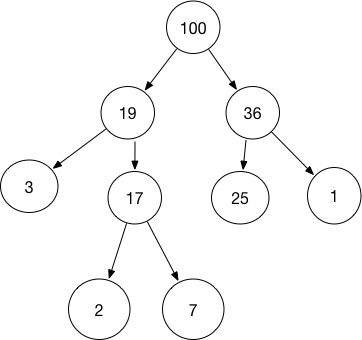

# 数据结构
是计算机中存储、组织数据的方式
数据结构意味着接口或封装：一个数据结构可被视为两个函数之间的接口，或者是由数据类型联合组成的存储内容的访问方法封装


# Linked List
链表是一种常见的基础数据结构，是一种线性表，但是并不会按线性的顺序存储数据，而是在每一个节点里存到下一个节点指针

使用链表结构可以克服数组链表需要预先知道数据大小的缺点，链表结构可以充分利用计算机内存，实现灵活的内存动态管理

链表即是由节点(Node)组成的线性集合，每个节点可以利用指针指向其他节点。它是一种包含了多个节点的，能够用于表示序列的数据结构。

## 链表的应用
链表用来构建许多其他数据结构，如堆栈，队列和他们的派生
节点的数据域也可以成为另一个链表，通过这种手段，可以用列表来构建许多链性数据结构


* 单向链表：
    链表中最简单的一种是单向链表，它包含两个域，一个信息域和一个指针域。这个链接指向列表的下一个节点，而最后一个节点则指向一个空值

    一个单链表的节点被分为两个部分。第一个部分保存或者显示关于节点的信息，第二部分存储下一个节点的地址。

    ```java
    class Node {
        int data;
        Node next;

        Node(int d) {
            data = d;
            next = null;
        }
    }
    ```
   
* 双向链表：
    每个节点有两个连接：一个指向前一个节点(当此“连接”时，指向空值或者空列表)；而另一个指向下一个节点(当此“连接”时，指向空值或者空列表)

    ```java
    class Node {
        private Node previous;//前驱节点
        private Node next; //后继节点
        private E e; //泛型元素
        public Node(Node previous, Node next, E e) {
            this.previous = previous;
            this.next = next;
            this.e = e;
        }
    }
    ```

* 循环链表：
    首节点和末节点被连接在一起

    ```java
    public class LinkedList {
        private Node head;
        private Node tail;
        int size;

        public LinkedList() {
            tail = head = null;
            size = 0;
        }

        public void addHead(Node hd) {
            if (size == 0) {
                hd.next = hd;
                tail = head = hd;
                size++;
            } else {
                tail.next = hd;
                hd.next = head;
                size++;
            }
        }

        public void addTail(Node tl) {
            if (size == 0) {
                tl.next = tl;
                tail = head = tl;
                size ++
            } else {
                tail.next = tl;
                tl.next = head;
                tail = tl;
                size++;
            }
        }
    }
    ```
* 时间复杂度：
    * 索引:O(n)
    * 搜索:O(n)
    * 插入:O(1)
    * 移除:O(1)

# Stack
* 栈是元素的集合，其包含了两个基本操作：push操作可以用于将元素压入栈，pop操作可以将栈顶元素移除。
* 遵循后入先出(LIFO)原则
* 时间复杂度：
    * 索引:(O(n))
    * 搜索:(O(n))
    * 插入:(O(1))
    * 移除:(O(1))

# Queue
* 队列是元素的集合，其包含了两个基本操作；enqueue操作可以用于将元素插入到队列中，而dequeeu操作则是将元素从队列中移除。
* 遵循先入先出原则(FIFO)。
* 时间复杂度：
    * 索引:(O(n))
    * 搜索:(O(n))
    * 插入:(O(1))
    * 移除:(O(1))

# Tree
是一种无向图，其中任意两个顶点间存在唯一一条路径，或者说，只要没有回路的连通图就是树。

## Binary Tree
二叉树是一种典型的树结构
* 二叉树即是每个节点最多包含左子节点与右子节点这两个节点的树形数据结构，通常分支被称作“左子树”和“右子树”。二叉树的分支具有左右次序，不能颠倒

   |完美二叉树|Perfect Binary Tree|除了叶子节点之外的每一个节点都有两个孩子，每一层(当然包含最后一层)都被完全填充|
   | :---: | :-----------------: | :------------------: |
   | 完全二叉树 | Complete Binary Tree | 除了最后一层之外的其他每一层都被完全填充，并且所有结点都保持左对齐 |
   | 完满二叉树 | Full/Strictly Binary Tree | 除了叶子结点之外的每一个结点都有两个孩子结点 |

### 存储二叉树

#### 顺序存储（数组存储）
二叉树可以用数组来存储，尤其是完美二叉树

#### 二叉链表存储
```java
class Node {
    private int value; //二叉树的值
    private Node leftChild; //左孩子节点
    private Node rightChild; //右孩子节点

    public(int value, Node leftChild, Node rightChild) {
        this.value = value;
        this.leftChild = leftChild;
        this.rightChild = rightChild;
    }
}
```

   

# Binary Search Tree
* 二叉搜索树(BST)是一种特殊的二叉树，其任何节点中的值都会大于或者等于其左子树中存储的值并且小于或者等于其右子树中存储的值。
* 时间复杂度：
    * 索引:O(log(n))
    * 搜索:O(log(n))
    * 插入:O(log(n))
    * 删除:O(log(n))

# Trie
* 字典树，又称基数或者前缀树，能够用于存储键为字符串的动态集合或者关联数组的搜索树。树中的节点并没有直接存储关键键值，而是该节点
  在树中挂载位置决定了其关联键值。某个节点的所有子节点都拥有相同的前缀，整棵树的根节点则是空字符串。

# Fenwick Tree
* 树状数组又称Binary Indexed Tree，其表现形式为树，不过本质上是以数组实现。数组中的下标代表着树种的顶点，每个顶点的父节点或者子节点
  的下标能够通过位运算或得

# Heap
* 堆是一种特殊的满足某些特性的数据结构，整个堆中的所有的父子节点的键值都会满足相同的排序条件。堆更准确可以分为最大堆和最小堆，在最大堆中，
  父节点的键值永远大小或者等于子节点的值，并且整个堆中的最大值存储与根节点；而最小堆中，父节点的键值永远小鱼或者等于其子节点的键值，并且
  整个堆中的最小值存储与根节点。
* 时间复杂度：
    * 访问:O(log(n))
    * 搜索:O(log(n))
    * 插入:O(log(n))
    * 移除:O(log(n))
    * 移除最大值/最小值:O(1)

    

# Hashing
* 哈希能够将任意长度的数据映射到固定长度的数据。哈希函数返回的即是哈希值，如果两个不同的键得到相同的哈希值，即将这种现象称为碰撞。
* Hash Map:HashMap是一种能够建立起键与值之间关系的数据结构，HashMap能够使用哈希函数将键转化为桶或者槽中的下标，
  从而优化对于目标值得搜索速度。
  碰撞解决
    * 链地址法(Separate Chaining)：链地址法中，每个桶是相互独立的，包含了一系列索引的列表。搜索操作的时间复杂度即是
        搜索桶的时间与遍历列表的时间之和。
    * 开地址法(Open Addressing)：在开地址法中，当插入新值时，会判断该值对应的哈希桶是否存在，如果存在则
        根据某种算法依次选择下一个可能的位置，直到找到一个尚未被占用的地址。所谓开地址也是指某个元素的位置并不
          永远由哈希值决定。

