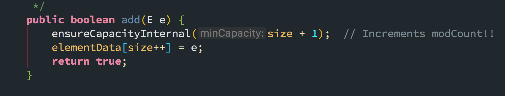
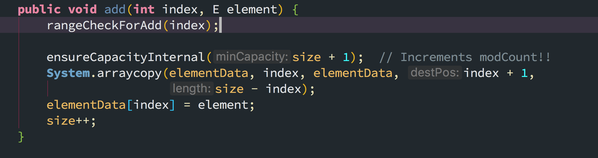
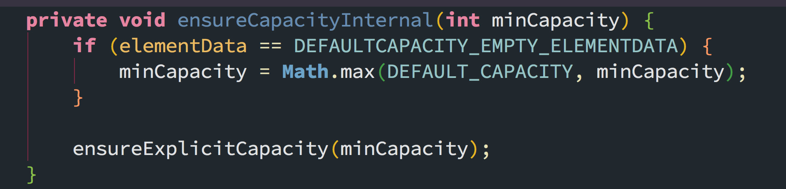
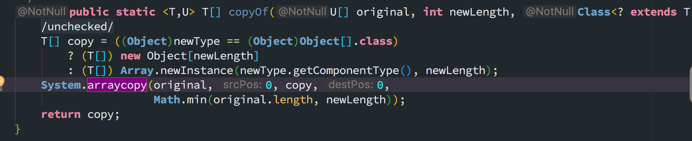
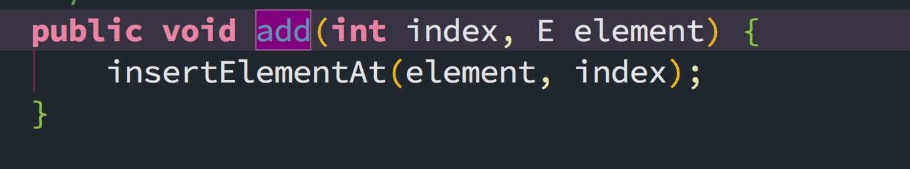
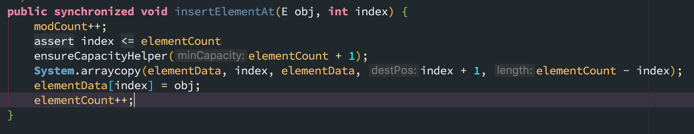

# 集合

## ArrayList

ArrayList实现了List、RandomAccess接口，可插入空数据，也支持随机访问。
ArrayList相当于动态数据，其中最重要的两个属性`elementData`数组，以及`size`大小。在调用`add()`方法的时候：

### add



- 首先进行扩容校验
- 将插入的值放到尾部，并将size+1



- 首先也是扩容
- 对数据进行复制，目的把index位置空出来放本次插入的数据，并将后面的数据向后移动一个位置。

#### 自动扩容



```java
private void ensureCapacityCapacity(int minCapacity) {
    modCount++;
    // 如果最低要求的存储能力大于ArrayList已有的存储能力
    if (minCapacity - elementData.length > 0) {
        // 需要扩容
        grow(min(minCapacity));
    }
}
```

```java
private void grow(int minCapacity) {
    int oldCapacity = elementData.length();
    // 首先设置新的存储能力为原来的1.5倍
    int newCapacity = oldCapacity + (oldCapacity >> 1);
    if (newCapacity - minCapacity < 0) {
        newCapacity = minCapacity;
    }
    // 与最大值比较，求取最大值
    if (newCapacity - MAX_ARRAY_SIZE > 0) {
        // ArrayList最大的存储能力为整数的范围
        newCapacity = hugeCapacity(minCapacity);
    }
    elementData = Arrays.copyOf(elementData, newCapacity);

}
```

native方法执行的数组复制
Arrays:


#### 序列化

由于ArrayList是基于动态数组实现的，所以并不是所有的空间都被使用（防止浪费了）。因此使用`transient`，可以防止自动序列化。

```java
private void wirteObject(java.io.ObjectOutputStream s) throws java.io.IOException{
    int expectedModCount = modConnt;
    s.defaultWriteObject();

    s.write(size);

    for (int i=0; i<size; i++) {
        s.wirteObject(elementData[i]);
    }

    if (modCount != expectedModCount) {
        throw new ConcurrentModificationException();
    }

}
```

当对象中自定义了writeObject和readObject方法时，JVM会调用这两个自定义方法来实现序列化与反序列化

### Vector

Vector也是实现了`List`，底层数据结构和`ArrayList`类似，也是一个动态数组存放数据。不过在add()方法的时候`synchronized`进行同步写数据，开销较大，所以`Verctor`是一个同步容器并不是一个并发容器。

```java
public synchronized boolean add(E e) {
    modCount++;
    ensureCapacityHelper(elementCont + 1);
    elementData[elementCount++] = e;
    return true;
}
```




## HashMap

### 概要

HashMap是一个关联数组、哈希表，它是线程不安全的，允许key为null，value为null。遍历时无序。其底层结构式数组称之为哈希桶，每个桶里放的是链表，链表中的每个节点，就是哈希表中的每个元素。
在JDK8中，当链表长度达到8，会转化红黑树，以提升它的查询、插入效率，它实现了`Map<K,V>`，`Cloneable`，`Serializable`接口

它根据键的hashCode值存储数据，大多数情况下可以直接定位到它的值，因而具有很快的访问速度，但遍历顺序却是不确定的。 HashMap最多只允许一条记录的键为null，允许多条记录的值为null。HashMap非线程安全，即任一时刻可以有多个线程同时写HashMap，可能会导致数据的不一致。如果需要满足线程安全，可以用 Collections的synchronizedMap方法使HashMap具有线程安全的能力，或者使用ConcurrentHashMap。

1. 默认容量 1<<4 = 16
2. 最大容量 1<<30 = 2^32
3. 默认加载因子 0.75f，当容量大于(容量x加载因子)，会进行扩容操作。
> 备注：异或的操作如下：0 ^ 0=0，1 ^ 1 =0，0 ^ 1=1，1 ^ 0=1，也就是相同时返回0，不同时返回1。

### 链表节点

挂载在哈希表上的元素，链表的结构：

```java
static class Node<K,V> implements Map.Entry<K,V> {
    final int hash;
    final K key;
    V value;
    Node<K,V> next;// 链表后置节点

    Node(int hash, K key, V value, Node<K,V> next) {
        this.hash = hash;
        this.key = key;
        this.value = value;
        this.next = next;
    }

    public final K getKey() {
        return key;
    }

    public final V getValue() {
        return value;
    }

// 设置新的value 同时返回旧的value
    public final V setValue(V newValue) {
        V oldValue = value;
        value = newValue;
        return oldValue;
    }

// 每一个节点的hash值，是将key的hashCode和value的hashCode亦或得到的
    public final int hashCode() {
        return Object.hashCode(key) ^ Object.hashCode(value);
    }

}
```

这是一个单链表，每一个节点的hash值，是将key的hashCode和value的hashCode亦或得到的

### 构造函数

```java
// 最大容量
static final int MAXIMUM_CAPACITY = 1 << 30;
// 默认加载因子
static final float DEFAULT_LOAD_FACTOR = 0.75f;

// 哈希桶，存放链表，长度是2的N次方，或者初始化时为0
transient Node<K, V>[] table;

// 加载因子，用于计算哈希表元素数量的阈值，会发生扩容
final float loadFactor;

// 哈希表内元素数量的阈值，当哈希表内元素数量超过阈值时，会发生扩容resize()
int threshold;

public HashMap() {
    // 默认构造，加载因子为默认的0.75
    this.loadFactor = DEFAULT_LOAD_FACTOR;
}

public HashMap<Map ? extend K, ? extends V m> {
    this.loadFactor = DEFAULT_LOAD_FACTOR;
    putMapEntries(m, false);
}


final void putMapEntries(Map<? extends K, ? extends V> m, boolean evict) {
    int s = m.size();
    if (s > 0) {
        // 如果当前列表是空的
        if (table == null) {
            // 根据m的元素数量和当前表的加载因子，计算出阈值
            float ft = ((float)s/loadFactor + 1.0f);
            int t = ((ft < (float)MAXIMUM_CAPACITY) ?
                         (int)ft : MAXIMUM_CAPACITY);
            //  返回一个新的阈值，满足2的n次方的阈值
            if (t > threshold) {
                threshold = tableSizeFor(t);
            }

        } else if (s > threshold)
            // m元素数量大于阈值，说明要扩容
            resize();

        // 遍历m依次将元素加入当前表中
        for (Map.Entry<? extends K, ? extends V> e : m.entrySet()) {
            K key = e.getKey();
            V value = e.getValue();
            putVal(hash(key), key, value, false, evict);
        }
    }
}

// 根据期望容量cap，返回2的n次方形式的哈希桶实际容量length，返回值一般会>=cap
static final int tableSizeFor(int cap) {
    int n = cap - 1;
    n |= n >>> 1;
    n |= n >>> 2;
    n |= n >>> 4;
    n |= n >>> 8;
    n |= n >>> 16;
    return (n < 0) ? 1 : (n >= MAXIMUM_CAPACITY) ? MAXIMUM_CAPACITY : n + 1;
}
```


扩容：

```java
final Node<K,V>[] resize() {
    // oldTab 为当前表的哈希桶
    Node<K, V> oldTab = table;
    // 当前哈系统的容量length
    int oldCap = (oldTab == null) ? 0 : oldTab.length;
    // 初始化新的容量和阈值为0
    int newCap, newThr = 0;
    // 如果当前容量大于0
    if (oldCap > 0) {
        // 如果当前容量已经到达上限
        if (old >= MAXIMUM_CAPACITY) {
            threshold = Integer.MAX_VALUE;
            return oldTab;
        }
        else if ((newCap = oldCap << 1) < MAXIMUM_CAPACITY && oldCap >= DEFAULT_INITIAL_CAPACITY)
            newThr = oldThr << 1;//如果旧的容量大于默认初始容量16，那么新的阈值也等于旧的阈值的两倍
    } //如果当前表示空的，但是有阈值，代表示初始化时指定了容量、阈值的情况
    else if (oldThr > 0) {
        newCap = oldThr;
    } else {//如果当前表是空的，而且也没有阈值。代表是初始化时没有任何容量/阈值参数的情况  
        newCap = DEFAULT_INITIAL_CAPACITY;//此时新表的容量为默认的容量 16
        newThr = (int)(DEFAULT_LOAD_FACTOR * DEFAULT_INITIAL_CAPACITY);//新的阈值为默认容量16 * 默认加载因子0.75f = 12
    }

    if (newThr == 0) {
        float ft = (float)newCap * loadFactor;
        newThr = (newCap < MAXIMUM_CAPACITY && ft < (float)MAXIMUM_CAPACITY ?
                    (int)ft : Integer.MAX_VALUE);
    }

    // 更新阈值
    threshold = newThr;

    // 根据新的容量 构建新的哈希桶
    Node<K,V>[] newTab = (Node<K,V>[])new Node[newCap];

    // 更新哈希桶引用
    table = newTab;

    // 如果以前的哈希桶中有元素
    // 将当前哈希桶中的所有字节转移到新的哈希桶中
    ...
}
```

## TreeSet和TreeMap的关系

TreeMap是Map接口的常用实现类，而TreeSet是Set接口的常用实现类。TreeSet底层是通过TreeMap来实现，而TreeMap的实现就是红黑树算法。

相同点：

1. TreeMap和TreeSet都是有序的集合
2. TreeMap和TreeSet都是非同步集合
3. 运行速度都要比HashMap集合慢，他们内部对元素的操作实现复杂度为O(logN)。

不同点：

1. 最主要区别是TreeSet和TreeMap分别实现了不同接口
    TreeSet只存储一个对象，而TreeMap存储两个对象Key和Value（仅仅key对象有序）
    TreeSet中不能有重复对象，而TreeMap中可以存在