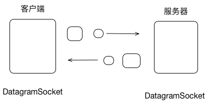

# 简介
Android与服务器的通信方式主要有两种，一种Http通信，一是Socket通信。两者的最大的差异在于，
http连接使用的是“请求--响应方式”，即在请求时建立连接通道，当客户端向服务发送请求后，服务端才能向
客户端返回数据。而Socket通信则是在双方建立起连接后可以直接进行数据的传输，在连接时可实现信息的主动
推送，而不需要每次由客户端向服务器发送请求。
Socket又称套接字，在程序内部提供了外界通信的端口，即端口通信。通过建立socket连接，可为通信双方的数据传输提供通道。
socket的主要特点有数据丢失率低，使用简单易于移植。

## Socket的分类
根据不同的底层协议，Socket的实现是多样化的。TCP/IP协议族当中主要是Socket类型为流套接字(streamsocket)
和数据报套接字(datagramsocket)。流套接字将TCP作为其端对端协议，提供了一个可信赖的字节流服务。
数据报套接字使用UDP协议，提供数据打包发送服务。

# Socket基本通信模型

### 2.1 TCP通信模型

### 2.2 UDP通信模型
