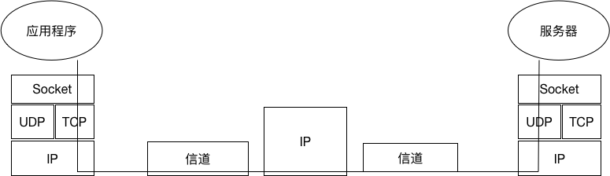

# 简介

Android与服务器的通信方式主要有两种，一种Http通信，一是Socket通信。两者的最大的差异在于，
http连接使用的是“请求--响应方式”，即在请求时建立连接通道，当客户端向服务发送请求后，服务端才能向
客户端返回数据。而Socket通信则是在双方建立起连接后可以直接进行数据的传输，在连接时可实现信息的主动
推送，而不需要每次由客户端向服务器发送请求。
Socket又称套接字，在程序内部提供了外界通信的端口，即端口通信。通过建立socket连接，可为通信双方的数据传输提供通道。
socket的主要特点有数据丢失率低，使用简单易于移植。

## Socket的分类

根据不同的底层协议，Socket的实现是多样化的。TCP/IP协议族当中主要是Socket类型为流套接字(streamsocket)
和数据报套接字(datagramsocket)。流套接字将TCP作为其端对端协议，提供了一个可信赖的字节流服务。
数据报套接字使用UDP协议，提供数据打包发送服务。

## Socket基本通信模型

### 2.1 TCP通信模型

### 2.2 UDP通信模型

## Socket基本实现原理

### 基于TCP协议的Socket

服务器端首先声明一个ServerSocket对象并且指定端口号，然后调用Serversocket的accept()方法接收客户端的数据。accept方法在没有数据进行接收
处于堵塞状态。一旦接收到数据，通过inputStream读取接收的数据。
客户端创建一个Socket对象，指定服务器端ip地址和端口号(Socketsocket=newSocket("172.168.10.108":8080);)，通过inputstream读取，获取
服务器发出的数据，最后将要发送的数据写入到outputstream即可进行TCP协议的socket数据传输。

### 基本UDP协议的数据传输

服务器端首先创建一个DatagramSocket对象，并且指点监听的端口。接下来创建一个空的DatagramSocket对象用于接收数据
（bytedata[] = newbyte[1024];DatagramSocketpacket=newDatagramSocket(data,data.length))，使用DatagramSocket
的receive方法接收客户端发送的数据，receive()与serversocket的accepet类似，在没有数据进行接收的处于堵塞状态。