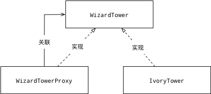

# 定义
给目标对象提供一个代理对象，并由代理对象控制对目标对象的引用
1. 代理对象：起到中介作用，连接客户端和目标对象

# 主要作用给
通过引入代理对象的方式来间接访问目标对象

# 解决的问题
防止直接访问目标对象给系统带来的不必要复杂性

# 优点
* 协调调用者和被调用者，降低系统的耦合度
* 代理对象作为客户端和目标对象之间的中介，起到了保护目标对象的作用

# 缺点
* 由于在客户端和真实主题之间增加了代理对象，因此会造成请求的处理速度变慢
* 实现代理模式需要额外的工作，从而增加了系统实现的复杂度。

# 应用场景
* 当需要为一个对象再不同的地址空间提供局部的代表时
此时的代理模式称为远程代理：为一个对象再不同的地址空间提供局部代表。

> 目的：
> 1. 隐藏一个对象存在于不同地址空间的事实
> 2. 远程机器可能具有更好的计算性能和处理速度，可以快速响应并处理客户端请求。

* 当需要创建开销非常大的对象时
此时的代理模式称为虚拟代理：通过使用过一个小的对象代理一个大的对象。
> 目的：减少系统的开销

* 当需要控制对原始对象的访问时
此时的代理模式称为保护代理：控制目标对象的访问，给不同的用户提供不同的访问权限

