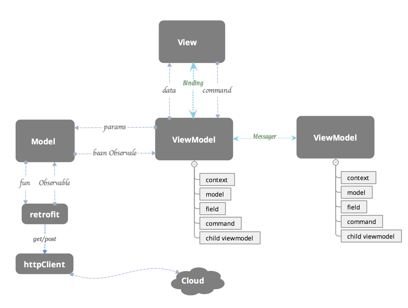

# 标准MVC

整个应用分为Model、View和Controller三个部分，而这些组成部分其实也有着几乎相同的职责。

* 视图：管理作为位图展示到屏幕上的图形和文字输出；
* 控制器：翻译用户的输入并依照用户的输入操作模型和视图；
* 模型：管理应用的行为和数据，响应时间请求（经常来自视图）和更新状态的指令（检查来自控制器）

控制器负责对模型中的数据进行更新，而视图向模式中请求数据；当有用户的行为触发操作时候，会有控制器更新模型，并通知视图进行更新，在这时视图向模型请求新的数据。

## 依赖关系

在MCV中，模型层可以单独工作，而视图层和控制器层都依赖于模型层中的数据。

# MVP

MVP是MVC的一个变种，最大的区别就是MVP中使用Presenter对视图和模型进行了解耦，它们都对对方一无所知，沟通都通过Presenter进行。

常见的MVP架构：1. Passive View 2. Supervising Controller

## 被动视图（Passive View）

MVP第一个变种就是被动视图(Passive View)，在该变种架构模式中，视图层是被动的，它本身不会改变自己的任何状态，所有的状态都是通过Presenter来间接改变的

### 依赖关系

视图成为了完全被动的并且不再根据模型来更新视图本身的内容。

因为视图层不依赖与任何层级也就最大化了视图层的可测试性，同时也将视图层和模型层进行了合理的分离，两者不再互相依赖

### 通信方式

被动视图的示意图中一共有四条线，用于表示Model、View和Presenter之间的通信：

1. 当视图接收到来自用户的事件时，会将事件转交给Presenter进行处理
2. 被动的视图向外界暴露接口，当需要更新视图时候Presenter通过视图暴露的接口更新视图内容
3. Presenter负责对模型进行操作和更新，在需要时取出其中存储的信息
4. 当模型层改变时，可以将改变的信息发送给观察者Presenter
在MVP的变种被动视图中，模型的操作以及视图的更新都仅通过Presenter作为中间人进行

## 监督控制器（Supervising Controller）

在监督控制器中，视图层接管了一部分视图逻辑，主要内容就是同步简单的视图和模型的状态；
而监督控制器就需要负责相应用户的输入以及一部分更加复杂的视图、模型状态同步工作。

对于用户输入的处理，监督控制器的做法与标准的MVP中的Presenter完全相同；但是对于视图、模型的同步工作，监督控制器会尽可能地将所有简单的属性以数据绑定的形式声明在视图层中。
剩下的无法通过上述方式直接绑定的属性就需要通过监督控制器来操作和更新了。

### 通信方式
监督控制器中的视图和模型层之间增加了两者之间的耦合，也就增加了整个架构的复杂性

视图和模型之间新增的依赖就是数据绑定的产物；视图通过声明式的语法与模型中的简单属性进行绑定，当模型发生改变时，会通知其观察者视图做出相应的更新。
通过这种方式能够减轻监督控制器的负担，减少其中的代码，将一部分逻辑交由视图进行处理；这样也就导致了视图同时可以被Presenter和数据绑定两种方式更新，相比于被动视图，监督控制器的方式降低了视图的可测试性和封装性

### MVP优缺点

#### 优点：

1. 解耦
2. 模块职责明确，层次清晰
3. Presenter可复用
4. 方便单元测试
5. 避免内存泄露，减轻Activity

#### 缺点

1. 非常笨重。一个View对应一个Presenter，轻业务一个Activity能解决就不要用
2. Presenter逻辑复杂
3. 代码复杂度，学习成本
4. 会增加很多方法数

# MVVM

MVVM(Model-view-viewmodel)是一种软件架构模式。

MVVM有助于将图形用户界面的开发与业务逻辑或后端（数据模型）开发分离开来。
MVVM的视图模型是一个值转换器，这意味着视图模型负责从模型中暴露（转换）数据对象，以便轻松管理和呈现对象。在这方面，视图模型比视图做的更多，并且处理大部分视图的显示逻辑。视图模型可以实现中介者模式。

在MVVM的实现中，引入了隐式的一个Binder层，而声明式的数据和命令的绑定在MVVM模式中就是通过它完成的

通过隐式的Binder来完成视图和视图模型两者之间的双向绑定。
MVVM中，其中最重要的不是如何同步视图和展示模式/视图模型之间的状态，是使用观察者模式、双向绑定还是其他机制都不是整个模式中最重要的部分，最为关键的展示模型/视图模型创建了一个视图的抽象，将视图中的状态和行为抽离出一个新抽象

MVVM是一种架构模式，而DataBinding是一个实现数据和UI绑定的框架，是构建MVVM模式的一个工具。

## Android中的MVVM

> View:对应于Activity和XML，负责View的绘制以及与用户交互
> Model：实体模型
> ViewModel：负责完成View与Model间的交互，负责业务逻辑

## 数据驱动

在常规的开发模式中，数据变化需要更新UI的时候，需要先获取UI控件的引用，然后再更新UI。获取用户的输入和操作也需要通过UI控件的引用。在MVVM中，这些都是通过数据驱动来自动完成的，数据变化后会自动更新UI，UI的改变也能自动反馈到数据层，数据成为主导因素。这样MVVM层在业务逻辑处理中只要关心数据，不需要直接和UI打交道，在业务处理过程中简单方便很多。

## 低耦合度

MVVM模式中，数据是独立于UI的。
数据和业务逻辑处于一个独立的ViewModel中，ViewModel只需要关注数据和业务逻辑，不需要和UI或者控件打交道。UI想怎么处理数据都由UI自己决定，ViewModel不涉及任何UI相关的事，也不持有UI控件的引用。即便是控件改变了

## 更新UI

在MVVM中，数据发生变化后，我们在工作线程直接修改ViewModel的数据即可，不用再考虑要切到主线程更新UI了，这些事情相关框架都帮我们做了。

# 如何构建MVVM应用框架

## 如何分工

构建MVVM框架首先要具体了解各个模块的分工。

## View

View层做的就是UI相关的工作，我们只在XML、Activity和Fragment写View层的代码，View层不做和业务相关的事，也就是我们在Activity不写业务逻辑和业务数据相关的代码，更新UI通过数据绑定实现，尽量在ViewModel里面做(更新绑定的数据源即可)，Activity要做的事就是初始化一些控件(如控件的颜色，添加RecyclerView的分割线)，View层可以提供更新UI的接口（但是我们更希望UI事件通过Command来绑定）。简单地说：View层不做任何业务逻辑、不涉及操作数据、不处理数据、UI和数据严格的分开。

## ViewModel

ViewModel层做的事情刚好和View层相反，ViewModel只做和业务逻辑和业务数据相关的事情，**不做任何和UI相关的事情**，ViewModel层不会持有任何控件的引用，更不会在ViewModel中通过UI控件的引用去做更新UI的事情。ViewModel就是专注于业务的逻辑处理，做的事情也都只是对数据的操作。同时DataBinding框架已经支持双向绑定，让我们可以通过双向绑定获取View层反馈给ViewModel层的数据，并对这些数据进行操作。

## Model

Model层最大的特点是被赋予了数据获取的职责，与我们平常Model层只定义实体对象的行为截然不同。数据的获取、存储、数据状态变化都是Model层的任务。Model包括实体模型(Bean)、Retrofit的Service，获取网络数据接口、本地存储接口、数据变化监听等。Model提供数据获取接口供ViewModel调用，经数据转换和操作并最终隐射到View层某个元素的属性上。

## 如何协作

MVVM不是从MVP进化而来，而是在MVP之后出现的一种“更好的”UI模式解决方案
ViewModel大致上就是MVP的Presenter的MVC的Controller了，而View和ViewModel间没有了MVP的界面接口，而是直接交互，用数据“绑定”的形式
让数据更新的事件不需要开发人员手动去编写特殊用例，而是自动地双向同步。数据绑定可以认为是Observer模式或者是Publish/Subscribe模式，原理都是为了用一种统一的集中的方式实现频繁需要被实现的数据更新问题。
比起MVP， MVVM不仅简化了业务与界面的依赖关系，还优化了数据频繁更新的解决方案，甚至可以说提供了一种有效的解决模式

## 优点

1. 提高了可维护性。解决了MVP大量的手动View和Model同步的问题，提供双向绑定。提高了代码的可维护性。
2. 简化测试。同步逻辑是交给Binder做的，View跟随Model同时变更，只需要保证Model的正确性。

## 缺点

1. 对于简单的UI来讲，MVVM是一种过度设计。
2. 在复杂的情况下，很难设计出足够通用的ViewModel。
3. 尽管数据绑定的神奇在于声明式，然而比起命令式，更难调试

## 对比MVP

ViewModel大致就是MVP的Presenter和MVC的Controller，而View和ViewModel间没有MVP的界面接口，而是直接交互，用数据“绑定”的形式让数据更新事件，自动地双向同步。绑定可以认为是Observer模式或者Publish/Subscribe模式，原理都是为了用一种统一的集中的方式实现频繁需要被实现的数据更新问题。
