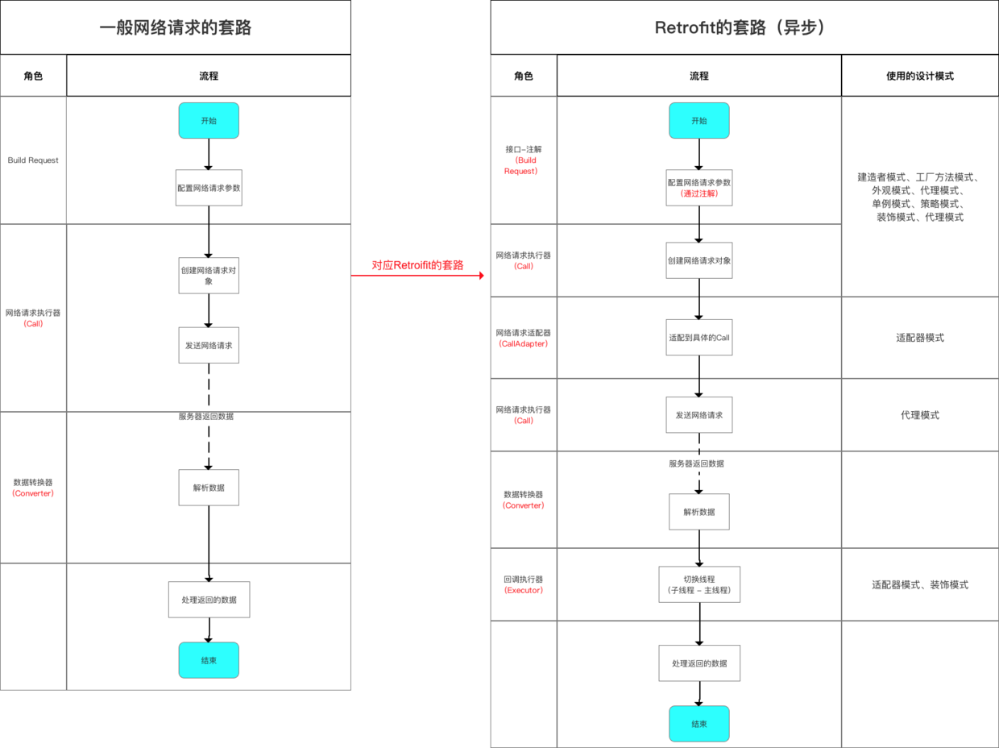

|       |Retrofit简介|
|:---:|:----:|
|介绍|一个RESTful的HTTP网络请求框架(基于OkHttp)|
|功能|* 基于OkHttp & 遵循Restful API设计风格 <br> * 通过注解配置网络请求参数 <br> * 支持同步 & 异步网络请求 <br>* 支持多种设计的解析 & 序列化(Gson、Json、 XMl)<br> * 提供对RxJava支持|
|优点|* 功能强大：支持同步&异步、支持多种数据的解析&序列化格式、支持RxJava<br> * 简洁易用：通过注解配置网络请求参数、采用大量设计模式简化使用<br> * 可拓展性好：功能模块彻底，如自定义Converters等等|
|应用场景|任何网络请求的需求场景都应优先选择|

RESTful 又是啥子？
- REpresentational State Transfer (主语被去掉了  Resource Representational State Transfer：资源在网络中以某种表现形式进行状态转移)
Resource：资源，即数据（前面说过网络的核心）。比如 newsfeed，friends等；
Representational：某种表现形式，比如用JSON，XML，JPEG等；
State Transfer：状态变化。通过HTTP动词实现。

特别注意：
- 准确来说，Retrofit是一个RESTful的Http网络请求框架的封装
- 原因：网络请求的工作本质是`OkHttp`完成，而Retrofit仅负责网络请求接口的封装
- App应用程序通过Retrofit请求网络，实际是使用Retrofit接口层封装请求参数、Header、Uri等信息，之后由OkHttp完成后续的请求操作
- 在服务端返回数据之后，OkHttp将原始的结构交给Retrofit，Retrofit根据用户的需求对结果进行解析


# 源码解析


具体过程解释如下：
1. 通过解析网络请求接口的注解 配置 网络请求参数
2. 通过动态代理生成网络请求对象
3. 通过网络请求适配器将网络请求对象进行平台适配
4. 通过网络请求执行器发送网络请求
5. 通过数据转换器解析服务器返回的数据
6. 通过回调执行器切换线程（子线程->>主线程）
7. 用户在主线程处理返回结果

|角色|作用|备注|
|网络请求执行器<br>(Call)|创建HTTP网络请求|Retrofit默认为okhttp3.Call|
|网络请求适配器<br>(CallAdapter)|网络请求执行器的适配器，将默认的网络请求执行器转换成适合被不同平台来调用的网络请求执行器形式|Retrofit支持Android/RxJava/java8/Guava四个平台<br>所以在Retrofit中提供了四种CallAdapterFactory:ExecutorCallAdapterFactory、GuavaCallAdapterFactory、Java8CallAdapterFactory、RxJavaCallAdapterFactory<br>好处：以最小的代价兼容更多平台，即能适配更多的使用场景|
|数据转换器(Converter)|将返回数据解析成我们需要的数据类型|Retrofit支持如XML、Gson、JSON|
|回调执行器(CallBackExecutor)|线程切换(子线程->主线程)|作用解释：将最后Okhttp的请求结果通过callbackExecutor使用Handler异步回调传回到主线程|

## 创建Retrofit实例
a.使用步骤
```java
 Retrofit retrofit = new Retrofit.Builder()
                                 .baseUrl("http://fanyi.youdao.com/")
                                 .addConverterFactory(GsonConverterFactory.create())
                                 .build();
```
b.源码分析
Retrofit实例是使用建造者模式通过Builder类进行创建的


